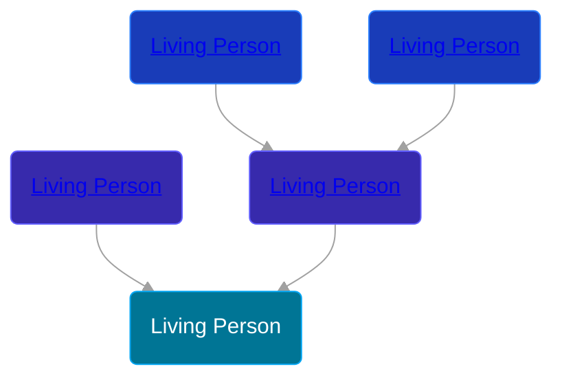

## 🔵 Living Person

Son of [Living Person](/people/2/24504153) and [Living Person](/people/4/44586772)



```mermaid
graph
classDef grands fill:#193cb8,stroke:#2b7fff,stroke-width:1px,color:#fff;
classDef parents fill:#372aac,stroke:#615fff,stroke-width:1px,color:#fff;
classDef primary fill:#007595,stroke:#00a6f4,stroke-width:1px,color:#fff;
43239855(Living Person):::primary
44586772(<a class="text-white" href="/people/4/44586772">Living Person</a>):::parents-->43239855
24504153(<a class="text-white" href="/people/2/24504153">Living Person</a>):::parents-->43239855
46067436(<a class="text-white" href="/people/4/46067436">Living Person</a>):::grands-->24504153
63426026(<a class="text-white" href="/people/6/63426026">Living Person</a>):::grands-->24504153
linkStyle default stroke:#a1a1a1
```

