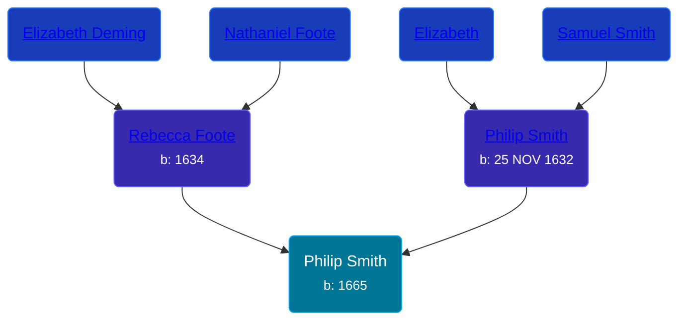

## 🔵 Philip Smith
<small>Age: 60y, 1m, 25d</small>

Son of [Philip Smith](/people/6/61981014) and [Rebecca Foote](/people/3/32470572)





### 📆 Events


Type | Date | Age at Event | Place
------ | ------ | ------ | ------
[Birth](#event-event-2) | 1665 |  |
[Death](#event-event-3) | 25 JAN 1725 | 60y, 1m, 25d |



- **[Birth](#event-event-2)**
**Date**: 1665, Age:
**Place**:
- **[Death](#event-event-3)**
**Date**: 25 JAN 1725, Age: 60y, 1m, 25d
**Place**:


### 📰 Event Sources

####  Birth, 1665
* The Foote Family: or the Descendants of Nathaniel Foote  - 277

####  Death, 25 JAN 1725
* History of the Town of Sunderland, Massachusetts  - 533