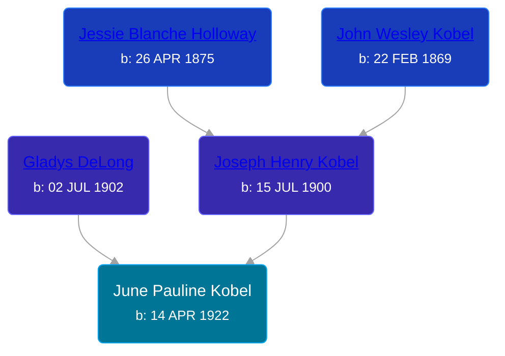

## 🟣 June Pauline Kobel
<small>Age: 82y, 6m, 23d</small>

Daughter of [Joseph Henry Kobel](/people/5/50400728) and [Gladys DeLong](/people/9/96793928)





### 📆 Events


Type | Date | Age at Event | Place
------ | ------ | ------ | ------
[Birth](#event-event-2) | 14 APR 1922 |  | Antrim, Michigan, USA
[Residence](#event-event-0) | 1930 | 7y, 7m, 16d | Grand Rapids, Kent, Michigan, United States
[Death](#event-event-4) | 07 NOV 2004 | 82y, 6m, 23d | Sun City Center, Hillsborough, Florida, USA



- **[Birth](#event-event-2)**
**Date**: 14 APR 1922, Age:
**Place**: Antrim, Michigan, USA
- **[Residence](#event-event-0)**
**Date**: 1930, Age: 7y, 7m, 16d
**Place**: Grand Rapids, Kent, Michigan, United States
- **[Death](#event-event-4)**
**Date**: 07 NOV 2004, Age: 82y, 6m, 23d
**Place**: Sun City Center, Hillsborough, Florida, USA


## 👩‍❤️‍👨 Relationships

### 🔵 [Living Person](/people/1/18153459)

### 📰 Event Sources

####  Birth, 14 APR 1922
* Ron Wilson's Research

####  Residence, 1930
* 1930 US Census

####  Death, 07 NOV 2004
* Ron Wilson's Research