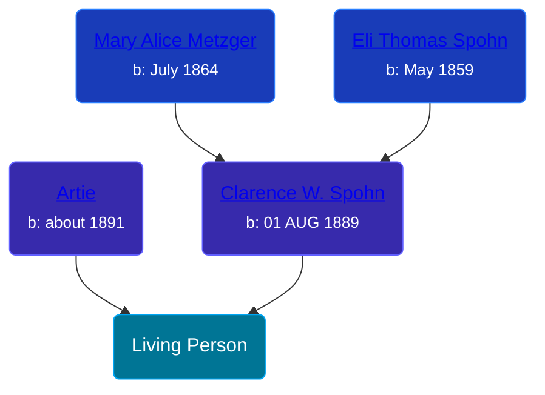

## 🟣 Living Person

Daughter of [Clarence W. Spohn](/people/6/64811370) and [Artie ](/people/4/49074271)



```mermaid
graph
classDef grands fill:#193cb8,stroke:#2b7fff,stroke-width:1px,color:#fff;
classDef parents fill:#372aac,stroke:#615fff,stroke-width:1px,color:#fff;
classDef primary fill:#007595,stroke:#00a6f4,stroke-width:1px,color:#fff;
43811338(Living Person):::primary
49074271(<a class="text-white" href="/people/4/49074271">Artie </a><br /><small>b: about 1891</small>):::parents-->43811338
64811370(<a class="text-white" href="/people/6/64811370">Clarence W. Spohn</a><br /><small>b: 01 AUG 1889</small>):::parents-->43811338
36824832(<a class="text-white" href="/people/3/36824832">Mary Alice Metzger</a><br /><small>b: July 1864</small>):::grands-->64811370
9010973(<a class="text-white" href="/people/9/9010973">Eli Thomas Spohn</a><br /><small>b: May 1859</small>):::grands-->64811370
```

