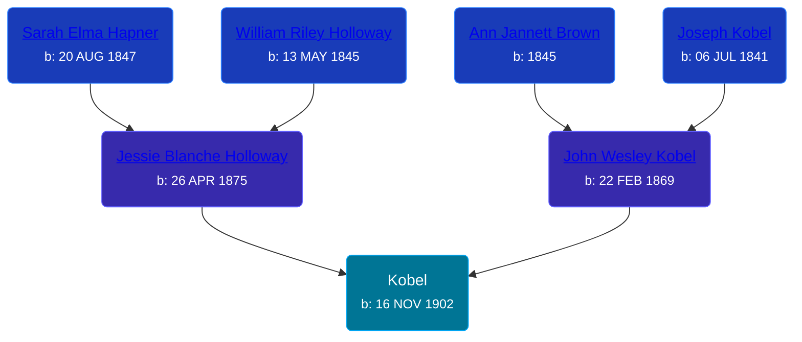

## 🔵 Kobel
<small>Age: 2d</small>

Son of [John Wesley Kobel](/people/2/24649136) and [Jessie Blanche Holloway](/people/2/29242864)





### 📆 Events


Type | Date | Age at Event | Place
------ | ------ | ------ | ------
Birth | 16 NOV 1902 |  | Michigan, USA
[Death](#event-event-3) | 18 NOV 1902 | 2d | Warner Township, Antrim, Michigan, USA



- **Birth**
**Date**: 16 NOV 1902, Age:
**Place**: Michigan, USA
- **[Death](#event-event-3)**
**Date**: 18 NOV 1902, Age: 2d
**Place**: Warner Township, Antrim, Michigan, USA


### 📰 Event Sources

####  Death, 18 NOV 1902
* Michigan Death Certificates
