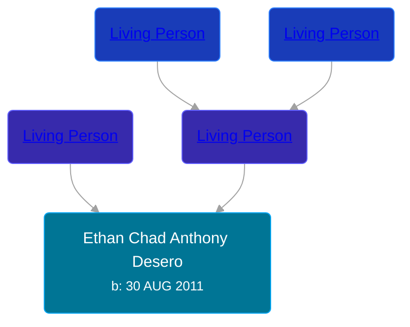

## 🔵 Ethan Chad Anthony Desero
<small>Age: 3y, 1d</small>

Son of [Living Person](/people/5/59787254) and [Living Person](/people/1/11240493)





### 📆 Events


Type | Date | Age at Event | Place
------ | ------ | ------ | ------
Birth | 30 AUG 2011 |  | Grand Rapids, Kent, Michigan, United States
[Death](#event-event-1) | 31 AUG 2014 | 3y, 1d | Kalamazoo, Kalamazoo, Michigan, USA
Burial |  |  | Vicksburg Cemetery, Vicksburg, Kalamazoo, Michigan, USA



- **Birth**
**Date**: 30 AUG 2011, Age:
**Place**: Grand Rapids, Kent, Michigan, United States
- **[Death](#event-event-1)**
**Date**: 31 AUG 2014, Age: 3y, 1d
**Place**: Kalamazoo, Kalamazoo, Michigan, USA
- **Burial**
**Date**:
**Place**: Vicksburg Cemetery, Vicksburg, Kalamazoo, Michigan, USA


### 📰 Event Sources

####  Death, 31 AUG 2014
* Lifestorynet.com
>
  > Ethan Desero
  > August 30, 2011 - August 31, 2014
  >
  > Ethan Chad Anthony Desero was born to Tony and Nicole (Zylstra) Desero on August 30, 2011 in Grand Rapids, Michigan. Weighing in at 7lbs 1oz and measuring 19 ½ inches, Ethan soon became a powerhouse among his older brothers: Austin was three years older and Kyle was seven years older. At 18 months, he was driving around the house in his little police car and outdoors on a small quad. Needless to say, Ethan loved motor vehicles, and he especially liked to hear the roar of his grandpa’s Harley Davidson motorcycle. Yet, this “all-boy” toddler never went anywhere without his blanket “Night Night.”
  >
  > In 2012, the family moved to Vicksburg, Michigan, where Tony owned and  operated Crystal Carpet Care, and Nicole remained at Spectrum Health as a Nurse Assistant. To Ethan’s delight, the family often went camping. Recently, they had made a trip to Mackinac Island, and Ethan was thrilled to go on the boat ride. That’s how he enjoyed the lakes of Michigan—not on the beaches, because he didn't like getting sand on his feet.
  >
  > In general, Ethan loved being outside. Perhaps that’s why he preferred the color green. Then again, it may ave been because, when he found money, he would claim, “My money, honey!” Among other notable expressions, Ethan’s favorite was, “Go away.” He seemed to know what he wanted and pursued it with vigor. He liked Tootsie Rolls, cereal and chocolate milk. In fact, his parents were quite sure that he would drink a cow dry if he could.
  >
  > Ethan was fond of dogs and particularly fascinated with the neighbor’s dogs. He was known to stand at the window and bark at them. What a comic picture that must have been! Such a “character” gave endless joy and laughter to his parents, siblings, grandparents, aunts and uncles. Ethan will live in their hearts for life.
  >
  > After being hospitalized the past month with leukemia, Ethan Chad Anthony Desero, of Vicksburg passed away on Sunday, August 31, 2014 at the age of 3. Survived by his parents: Tony and Nicole Desero, of Vicksburg; two siblings: Austin Desero, of Vicksburg and Kyle Morris, of OK; maternal grandparents “nannie and poppie”: Chad and Kim Zylstra, of Hudsonville; paternal grandmother: Gloria Bowler, of Grand Rapids; uncles: two John Zylstra and Drew Desero; great grandma “GG”: Martha Wilson, of Wyoming; great grandparents: Rick and Patricia Zylstra, of Hudsonville; two aunts: April Fulmer and Alyssia Centeno. He is preceded in death by paternal grandfather: Doug Desero; one great grandfather: Duane Wilson.
  >
  > The family will receive friends on Saturday, September 6th from 10-11AM at the Life Story Funeral Home, 409 S. Main Street, Vicksburg (269-649-1697). The funeral service will be held on Saturday at 11AM with Pastor Dave Downs officiating. Burial at Vicksburg Cemetery. Please visit Ethan’s webpage at www.lifestorynet.com where you can read his life story, sign his guestbook, share a memory and/or photo. Those who wish may
  > make a memorial contributions to the family.
