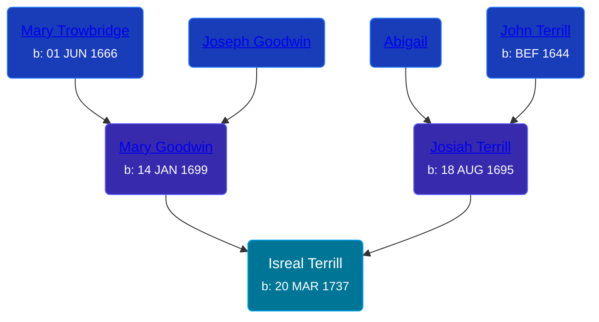

## 🔵 Isreal Terrill
<small>Age: 80y, 2m, 22d</small>

Son of [Josiah Terrill](/people/8/80183041) and [Mary Goodwin](/people/4/49404198)





### 📆 Events


Type | Date | Age at Event | Place
------ | ------ | ------ | ------
[Birth](#event-event-2) | 20 MAR 1737 |  | Milford, Connecticut, USA
[Baptism](#event-event-0) | 20 MAR 1736 | -1y |
[Death](#event-event-4) | 12 JUN 1817 | 80y, 2m, 22d |



- **[Birth](#event-event-2)**
**Date**: 20 MAR 1737, Age:
**Place**: Milford, Connecticut, USA
- **[Baptism](#event-event-0)**
**Date**: 20 MAR 1736, Age: -1y
**Place**:
- **[Death](#event-event-4)**
**Date**: 12 JUN 1817, Age: 80y, 2m, 22d
**Place**:


### 📰 Event Sources

####  Baptism, 20 MAR 1736
* Roger and Abigail (Ufford) Terrill and Some Descendants: 1632 - 1993  - 22

####  Birth, 20 MAR 1737
* Roger and Abigail (Ufford) Terrill and Some Descendants: 1632 - 1993  - 22
* The Town and City of Waterbury, Connecticut  - 135

####  Death, 12 JUN 1817
* Roger and Abigail (Ufford) Terrill and Some Descendants: 1632 - 1993  - 38