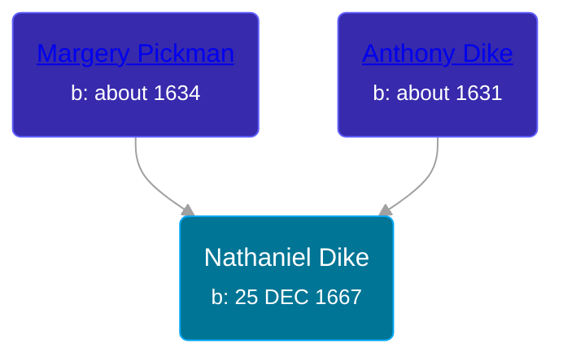

## 🔵 Nathaniel Dike
<small>Age: 78y, 7m, 5d</small>

Son of [Anthony Dike](/people/4/42674230) and [Margery Pickman](/people/1/13378816)





### 📆 Events


Type | Date | Age at Event | Place
------ | ------ | ------ | ------
[Birth](#event-event-2) | 25 DEC 1667 |  | Salem, Massachusetts, USA
[Death](#event-event-3) | Aug 1746 | 78y, 7m, 5d | Dudley, Massachusetts, USA



- **[Birth](#event-event-2)**
**Date**: 25 DEC 1667, Age:
**Place**: Salem, Massachusetts, USA
- **[Death](#event-event-3)**
**Date**: Aug 1746, Age: 78y, 7m, 5d
**Place**: Dudley, Massachusetts, USA


## 👩‍❤️‍👨 Relationships

### 🟣 [Hannah Thompson](/people/1/1871336), b. 1670

#### Children With Hannah Thompson
* 🔵 [James Dike](/people/2/20400692), b. Oct 1719
### 📰 Event Sources

####  Birth, 25 DEC 1667
* Patrick Wilson's Research

####  Death, Aug 1746
* Patrick Wilson's Research