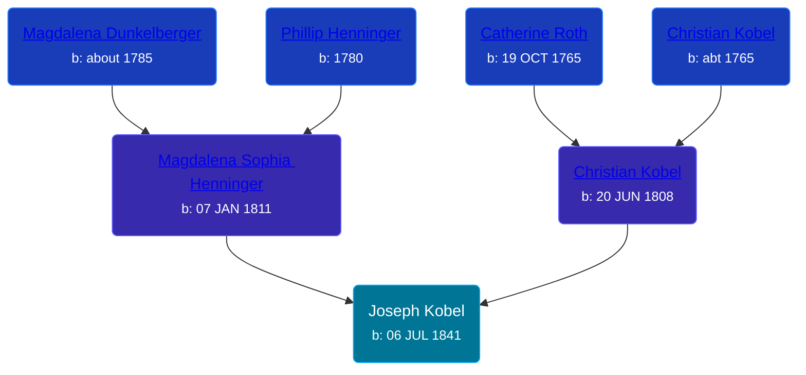

## 🔵 Joseph Kobel
<small>Age: 59y, 5m, 16d</small>

Son of [Christian Kobel](/people/1/17423128) and [Magdalena Sophia Henninger](/people/6/64241610)





### 📆 Events


Type | Date | Age at Event | Place
------ | ------ | ------ | ------
[Birth](#event-event-2) | 06 JUL 1841 |  | Wayne, Ohio, USA
[Residence](#event-event-0) | 18 SEP 1850 | 9y, 2m, 12d | Superior, Williams, Michigan, USA
[Residence](#event-event-1) | 30 JUN 1870 | 28y, 11m, 24d | Union Township, Antrim, Michigan, USA
[Residence](#event-event-2) | 16 JUN 1880 | 38y, 11m, 10d | Union Township, Antrim, Michigan, USA
[Residence](#event-event-3) | 01 JUN 1900 | 58y, 10m, 25d | Warner Township, Antrim, Michigan, USA
[Death](#event-event-7) | 22 DEC 1900 | 59y, 5m, 16d | Elmira Township, Antrim, Michigan, USA
Burial |  |  | Maple Hill Cemetery, Warner Township, Antrim, Michigan, USA



- **[Birth](#event-event-2)**
**Date**: 06 JUL 1841, Age:
**Place**: Wayne, Ohio, USA
- **[Residence](#event-event-0)**
**Date**: 18 SEP 1850, Age: 9y, 2m, 12d
**Place**: Superior, Williams, Michigan, USA
- **[Residence](#event-event-1)**
**Date**: 30 JUN 1870, Age: 28y, 11m, 24d
**Place**: Union Township, Antrim, Michigan, USA
- **[Residence](#event-event-2)**
**Date**: 16 JUN 1880, Age: 38y, 11m, 10d
**Place**: Union Township, Antrim, Michigan, USA
- **[Residence](#event-event-3)**
**Date**: 01 JUN 1900, Age: 58y, 10m, 25d
**Place**: Warner Township, Antrim, Michigan, USA
- **[Death](#event-event-7)**
**Date**: 22 DEC 1900, Age: 59y, 5m, 16d
**Place**: Elmira Township, Antrim, Michigan, USA
- **Burial**
**Date**:
**Place**: Maple Hill Cemetery, Warner Township, Antrim, Michigan, USA


## 👩‍❤️‍👨 Relationships

### 🟣 [Ann Jannett Brown](/people/2/25015094), b. 1845

#### Events


Type | Date | Age at Event | Place
------ | ------ | ------ | ------
Marriage | about 1862 | 20y, 4m, 24d |



- **Marriage**
**Date**: about 1862, Age: 20y, 4m, 24d
**Place**:


#### Children With Ann Jannett Brown
* 🔵 [Henry L. Kobel](/people/6/66319774), b. 06 DEC 1863
* 🔵 [John Wesley Kobel](/people/2/24649136), b. 22 FEB 1869
### 🟣 [Elnora Daughtery](/people/9/92071632), b. 22 JUN 1853

#### Events


Type | Date | Age at Event | Place
------ | ------ | ------ | ------
[Marriage](#event-family-1-event-0) | 15 NOV 1879 | 38y, 4m, 9d | Lincoln, Isabella, Michigan, USA



- **[Marriage](#event-family-1-event-0)**
**Date**: 15 NOV 1879, Age: 38y, 4m, 9d
**Place**: Lincoln, Isabella, Michigan, USA


### 📰 Event Sources

####  Birth, 06 JUL 1841
* Ron Wilson's Research

####  Residence, 18 SEP 1850
* 1850 US Census
>   
  > Name: Joseph Koble  
  > Gender: Male  
  > Race: White  
  > Age: 8  
  > Birth Year: abt 1842  
  > Birthplace: Ohio  
  > Home in 1850: Superior, Williams, Ohio, USA  
  > Attended School: Yes  
  > Line Number: 16  
  > Dwelling Number: 546  
  > Family Number: 548  
  > Inferred Father:   
  > Christian Koble  
  > Inferred Mother:   
  > Sarah Koble

####  Marriage, about 1862

####  Residence, 30 JUN 1870
* 1870 US Census

####  Marriage, 15 NOV 1879
* Michigan, Marriage Records, 1867-1952
>   
  > Name:Joseph Kobel  
  > Gender:Male  
  > Race:White  
  > Birth Year:abt 1841  
  > Birth Place:Ohio  
  > Marriage Date:15 Nov 1879  
  > Marriage Place:Lincoln, Isabella, Michigan, USA  
  > Age:38  
  > Residence Place:Union Isabella Co  
  > Spouse:Elnora Dougherty  
  > Record Number:585  
  > Film:17  
  > Film Description:1878 Washtenaw - 1879 Lake

####  Residence, 16 JUN 1880
* 1880 US Census

####  Residence, 01 JUN 1900
* 1900 US Census
####  Death, 22 DEC 1900
* Michigan, Death Records, 1867-1950
>   
  > Name: Joseph Kobel  
  > Birth Year: 1841  
  > Death Date: 22 Dec 1900  
  > Death Place: Warner, Antrim, Michigan, USA  
  > Age: 59  
  > Father's name: Christian Kobel
