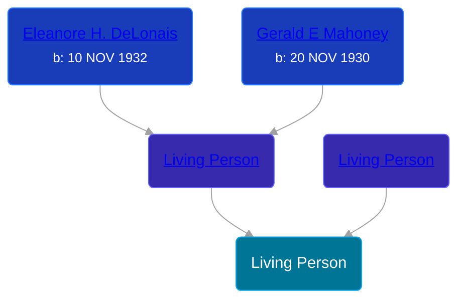

## 🟣 Living Person

Daughter of [Living Person](/people/9/92212432) and [Living Person](/people/6/6203854)



```mermaid
graph
classDef grands fill:#193cb8,stroke:#2b7fff,stroke-width:1px,color:#fff;
classDef parents fill:#372aac,stroke:#615fff,stroke-width:1px,color:#fff;
classDef primary fill:#007595,stroke:#00a6f4,stroke-width:1px,color:#fff;
44831850(Living Person):::primary
6203854(<a class="text-white" href="/people/6/6203854">Living Person</a>):::parents-->44831850
45463626(<a class="text-white" href="/people/4/45463626">Eleanore H. DeLonais</a><br /><small>b: 10 NOV 1932</small>):::grands-->6203854
10062624(<a class="text-white" href="/people/1/10062624">Gerald E Mahoney</a><br /><small>b: 20 NOV 1930</small>):::grands-->6203854
92212432(<a class="text-white" href="/people/9/92212432">Living Person</a>):::parents-->44831850
linkStyle default stroke:#a1a1a1
```

