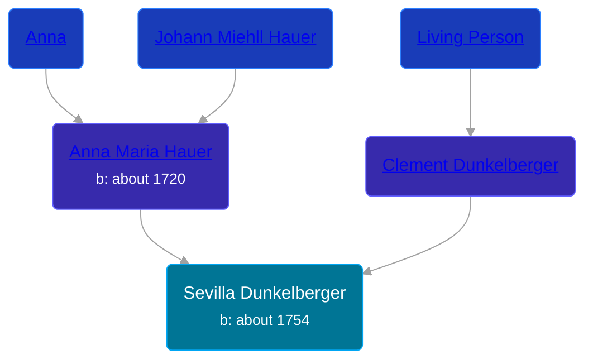

## 🟣 Sevilla Dunkelberger
<small>Age: 91y, 4m, 25d</small>

Daughter of [Clement Dunkelberger](/people/1/13545057) and [Anna Maria Hauer](/people/2/22963774)





### 📆 Events


Type | Date | Age at Event | Place
------ | ------ | ------ | ------
[Birth](#event-event-2) | about 1754 |  | Windsor Township, Berks, Pennsylvania, USA
[Death](#event-event-3) | 25 APR 1845 | 91y, 4m, 25d |



- **[Birth](#event-event-2)**
**Date**: about 1754, Age:
**Place**: Windsor Township, Berks, Pennsylvania, USA
- **[Death](#event-event-3)**
**Date**: 25 APR 1845, Age: 91y, 4m, 25d
**Place**:


### 📰 Event Sources

####  Birth, about 1754
* The Dunkelberger Family: Europe to America, 1600-1982

####  Death, 25 APR 1845
* The Dunkelberger Family: Europe to America, 1600-1982