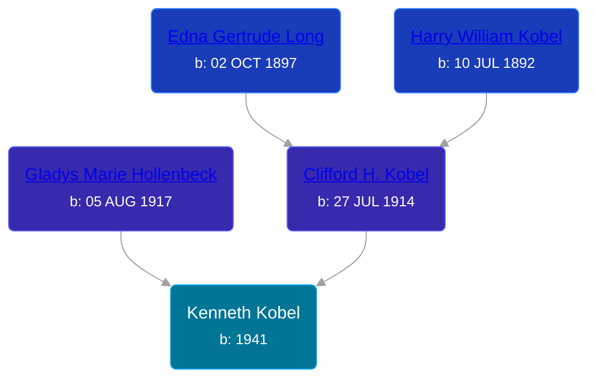

## 🔵 Kenneth Kobel
<small>Age: 66y</small>

Son of [Clifford H. Kobel](/people/2/28732388) and [Gladys Marie Hollenbeck](/people/5/52265274)





### 📆 Events


Type | Date | Age at Event | Place
------ | ------ | ------ | ------
[Birth](#event-event-2) | 1941 |  |
[Death](#event-event-3) | 2007 | 66y |



- **[Birth](#event-event-2)**
**Date**: 1941, Age:
**Place**:
- **[Death](#event-event-3)**
**Date**: 2007, Age: 66y
**Place**:


### 📰 Event Sources

####  Birth, 1941
* Ron Wilson's Research

####  Death, 2007
* Ron Wilson's Research