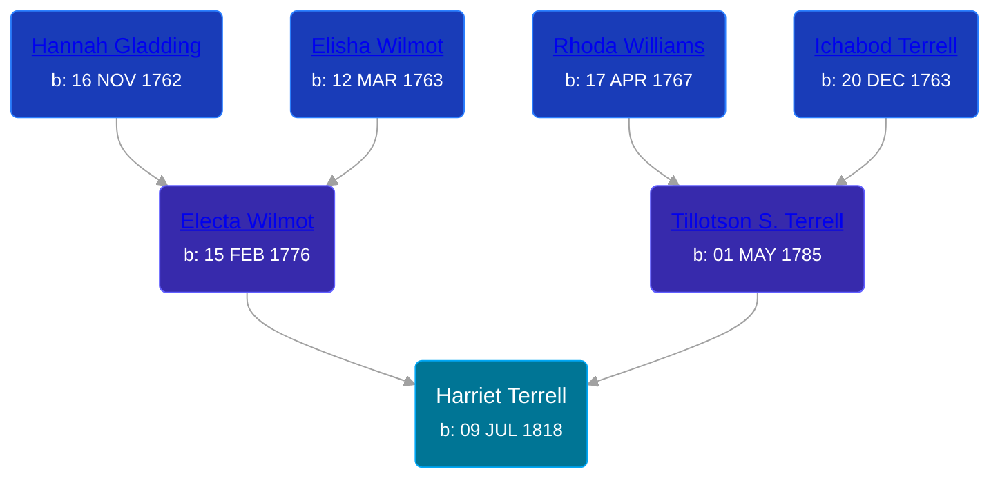

## 🟣 Harriet Terrell
<small>Age: 81y, 8m, 13d</small>

Daughter of [Tillotson S. Terrell](/people/2/25548435) and [Electa Wilmot](/people/7/77370498)





### 📆 Events


Type | Date | Age at Event | Place
------ | ------ | ------ | ------
Birth | 09 JUL 1818 |  | Ridgeville, Lorain, Ohio, USA
Death | 22 MAR 1900 | 81y, 8m, 13d | Ridgeville, Lorain, Ohio, USA



- **Birth**
**Date**: 09 JUL 1818, Age:
**Place**: Ridgeville, Lorain, Ohio, USA
- **Death**
**Date**: 22 MAR 1900, Age: 81y, 8m, 13d
**Place**: Ridgeville, Lorain, Ohio, USA

