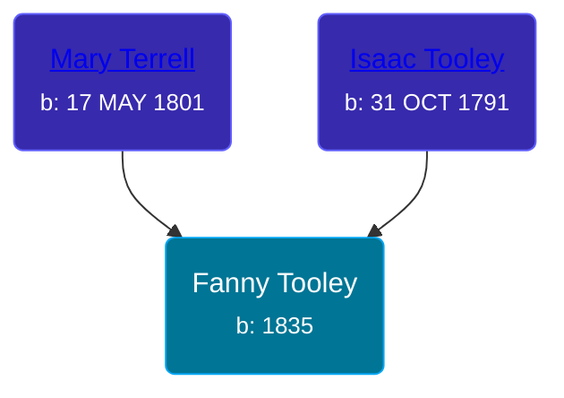

## 🟣 Fanny Tooley
<small>Age: 77y</small>

Daughter of [Isaac Tooley](/people/6/65071054) and [Mary Terrell](/people/3/36199064)





### 📆 Events


Type | Date | Age at Event | Place
------ | ------ | ------ | ------
Birth | 1835 |  |
[Residence](#event-event-0) | 11 SEP 1850 | 15y, 9m, 11d | Shelby, Orleans, New York, USA
[Residence](#event-event-1) | 23 JUN 1860 | 25y, 6m, 23d | Paris Township, Kent, Michigan, USA
[Residence](#event-event-2) | 1870 | 35y | Paris Township, Kent, Michigan, USA
Death | 1912 | 77y |
[Burial](#event-event-7) |  |  | Oak Grove Cemetery, Grand Rapids, Kent, Michigan, United States



- **Birth**
**Date**: 1835, Age:
**Place**:
- **[Residence](#event-event-0)**
**Date**: 11 SEP 1850, Age: 15y, 9m, 11d
**Place**: Shelby, Orleans, New York, USA
- **[Residence](#event-event-1)**
**Date**: 23 JUN 1860, Age: 25y, 6m, 23d
**Place**: Paris Township, Kent, Michigan, USA
- **[Residence](#event-event-2)**
**Date**: 1870, Age: 35y
**Place**: Paris Township, Kent, Michigan, USA
- **Death**
**Date**: 1912, Age: 77y
**Place**:
- **[Burial](#event-event-7)**
**Date**:
**Place**: Oak Grove Cemetery, Grand Rapids, Kent, Michigan, United States


### 📰 Event Sources

####  Residence, 11 SEP 1850
* 1850 US Census

####  Residence, 23 JUN 1860
* 1860 US Census

####  Residence, 1870
* 1870 US Census

####  Burial
* findagrave.com
