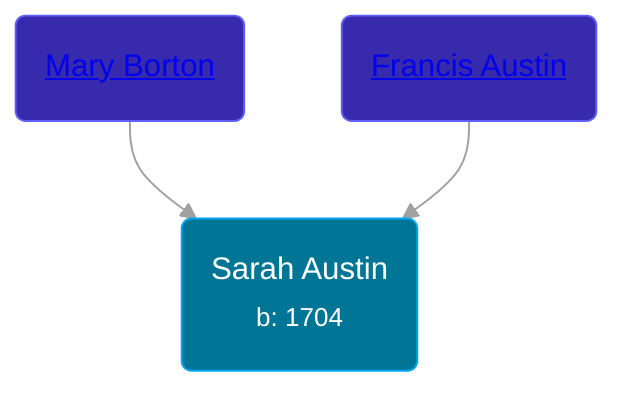

## 🟣 Sarah Austin
<small>Age: 35y</small>

Daughter of [Francis Austin](/people/2/23815487) and [Mary Borton](/people/3/39788960)





### 📆 Events


Type | Date | Age at Event | Place
------ | ------ | ------ | ------
Birth | 1704 |  | Evesham Township, Burlington, New Jersey, USA
Death | 1739 | 35y | Evesham Township, Burlington, New Jersey, USA



- **Birth**
**Date**: 1704, Age:
**Place**: Evesham Township, Burlington, New Jersey, USA
- **Death**
**Date**: 1739, Age: 35y
**Place**: Evesham Township, Burlington, New Jersey, USA


## 👩‍❤️‍👨 Relationships

### 🔵 [Nathan Haines](/people/7/74064515), b. 19 SEP 1702

#### Events


Type | Date | Age at Event | Place
------ | ------ | ------ | ------
Marriage | BET 01 MAR 1724 AND 01 MAR 1726 | 20y, 3m, 1d | Haddenfield, Gloucester, New Jersey, USA



- **Marriage**
**Date**: BET 01 MAR 1724 AND 01 MAR 1726, Age: 20y, 3m, 1d
**Place**: Haddenfield, Gloucester, New Jersey, USA


#### Children With Nathan Haines
* 🟣 [Mary Haines](/people/5/53194016), b. 1737
### 📰 Event Sources

####  Marriage, BET 01 MAR 1724 AND 01 MAR 1726
