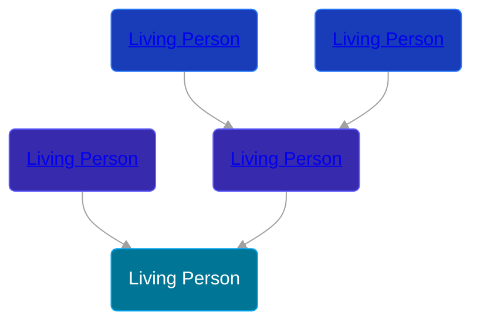

## 🟣 Living Person

Daughter of [Living Person](/people/2/21284059) and [Living Person](/people/7/72063628)





## 👩‍❤️‍👨 Relationships

### 🔵 [Living Person](/people/1/13968890)

#### Children With Living Person
* 🟣 [Living Person](/people/7/76470341)
* 🔵 [Living Person](/people/4/42256024)
* 🔵 [Living Person](/people/6/68205824)