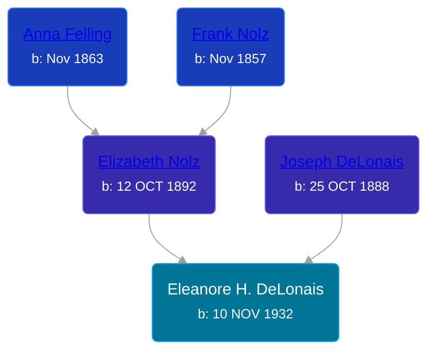

## 🟣 Eleanore H. DeLonais
<small>Age: 82y, 6m, 4d</small>

Daughter of [Joseph DeLonais](/people/7/72748828) and [Elizabeth Nolz](/people/3/37387446)





### 📆 Events


Type | Date | Age at Event | Place
------ | ------ | ------ | ------
[Birth](#event-event-3) | 10 NOV 1932 |  |
[Residence](#event-event-0) | 13 APR 1940 | 7y, 5m, 3d | Grand Rapids, Kent, Michigan, United States
[Death](#event-event-5) | 14 MAY 2015 | 82y, 6m, 4d |
Burial |  |  | Resurrection Cemetery, Wyoming, Kent, Michigan, USA



- **[Birth](#event-event-3)**
**Date**: 10 NOV 1932, Age:
**Place**:
- **[Residence](#event-event-0)**
**Date**: 13 APR 1940, Age: 7y, 5m, 3d
**Place**: Grand Rapids, Kent, Michigan, United States
- **[Death](#event-event-5)**
**Date**: 14 MAY 2015, Age: 82y, 6m, 4d
**Place**:
- **Burial**
**Date**:
**Place**: Resurrection Cemetery, Wyoming, Kent, Michigan, USA


## 👩‍❤️‍👨 Relationships

### 🔵 [Gerald E Mahoney](/people/1/10062624), b. 20 NOV 1930

#### Children With Gerald E Mahoney
* 🔵 [Living Person](/people/5/57716919)
* 🟣 [Living Person](/people/8/82431921)
* 🔵 [John Edward Mahoney](/people/2/20318131), b. 11 NOV 1961
* 🟣 [Living Person](/people/6/6203854)
### 📰 Event Sources

####  Birth, 10 NOV 1932
* facebook.com

####  Residence, 13 APR 1940
* 1940 US Census

####  Death, 14 MAY 2015
* MLive
>   
  > Mahoney, Eleanore H. Eleanore H. Mahoney, age 82, of Wyoming, passed away peacefully surrounded by her family on Thursday, May 14, 2015. She was the daughter of Joseph and Elizabeth (Nolz) DeLonais. She will be lovingly remembered by her husband of 59 years, Gerald Mahoney; children, Dr. Ann (Ben) Knapp, John Mahoney, Mary (Chuck) Russcher, David (Debbie) Mahoney; eight grandchildren, Joshua, Sara, Nathan, Katie, Hannah, Eric, Kyle and Jacob; brother-in-law and sisters-in-law, Tom (Carol) Mahoney, Marian Mahoney; and several nieces and nephews. She was preceded in death by her brother, Joseph DeLonais, Jr.; sisters, MaryAnn Jourden and Marcella Dunneback. Eleanore had a passion for traveling and a very friendly outgoing personality. The family would like to give a special thanks to the home health aides of Health Partners and the staff at Spectrum Health Hospice for their compassion and wonderful care. A Mass of Christian Burial will be held on Tuesday at 11:00 am at St. John Vianney Church, 4101 Clyde Park SW, Wyoming with Fr. Mike Alber presiding. Interment Resurrection Cemetery. Relatives and friends may meet the family at the church on Tuesday from 10-11am prior to the service. Memorial contributions may be made to Autism Support of Kent County or American Diabetes Association. Condolences may be sent online at www.mkdfuneralhome.com.
