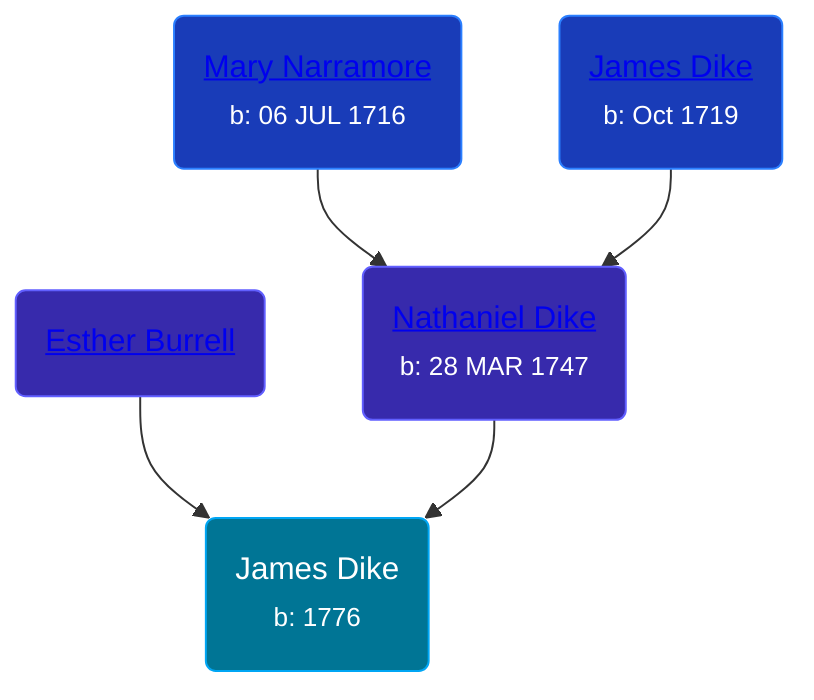

## 🔵 James Dike
<small>Age: 68y, 2m, 8d</small>

Son of [Nathaniel Dike](/people/3/36914917) and [Esther Burrell](/people/6/66432130)





### 📆 Events


Type | Date | Age at Event | Place
------ | ------ | ------ | ------
[Birth](#event-event-2) | 1776 |  |
[Death](#event-event-3) | 08 FEB 1844 | 68y, 2m, 8d |



- **[Birth](#event-event-2)**
**Date**: 1776, Age:
**Place**:
- **[Death](#event-event-3)**
**Date**: 08 FEB 1844, Age: 68y, 2m, 8d
**Place**:


## 👩‍❤️‍👨 Relationships

### 🟣 [Living Person](/people/5/5158330)

### 📰 Event Sources

####  Birth, 1776
* The Wellsville Story

####  Death, 08 FEB 1844
* The Wellsville Story