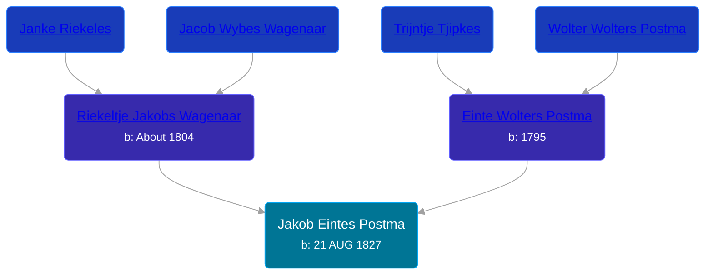

## 🔵 Jakob Eintes Postma
<small>Age: 45y, 10m, 12d</small>

Son of [Einte Wolters Postma](/people/1/18880768) and [Riekeltje Jakobs Wagenaar](/people/7/77820694)





### 📆 Events


Type | Date | Age at Event | Place
------ | ------ | ------ | ------
[Birth](#event-event-2) | 21 AUG 1827 |  | Surhuisterveen, Netherlands
[Death](#event-event-3) | 03 JUL 1873 | 45y, 10m, 12d | Grootegast, Netherlands



- **[Birth](#event-event-2)**
**Date**: 21 AUG 1827, Age:
**Place**: Surhuisterveen, Netherlands
- **[Death](#event-event-3)**
**Date**: 03 JUL 1873, Age: 45y, 10m, 12d
**Place**: Grootegast, Netherlands


## 👩‍❤️‍👨 Relationships

### 🟣 [Antje Veltman](/people/9/90951593), b. 04 FEB 1824

#### Events


Type | Date | Age at Event | Place
------ | ------ | ------ | ------
[Marriage](#event-family-0-event-0) | 22 DEC 1849 | 22y, 4m, 1d | Achtkarspelen, Netherlands



- **[Marriage](#event-family-0-event-0)**
**Date**: 22 DEC 1849, Age: 22y, 4m, 1d
**Place**: Achtkarspelen, Netherlands


#### Children With Antje Veltman
* 🔵 [Hendrik Jakob Postma](/people/3/31727152), b. 27 FEB 1859
### 📰 Event Sources

####  Birth, 21 AUG 1827
* Dutch Civil Register
>   
  > Source: Civil register - Birth  
  > Archive location: Tresoar, Frysk Histoarysk en Letterkundich Sintrum  
  > General Municipality: Achtkarspelen  
  > Type of record: Geboorteakte  
  > Record number: B 55  
  > Registration date: 23-08-1827  
  > Child: Jakob Eintes Postma  
  > Gender: M  
  > Date of birth: 21-08-1827  
  > Father: Einte Wolters Postma  
  > Mother: Riekeltje Jakobs Wagenaar

####  Marriage, 22 DEC 1849
* Dutch Civil Register
>   
  > Source: Civil register - Marriage  
  > Archive location: Tresoar, Frysk Histoarysk en Letterkundich Sintrum  
  > General Number of finding aid: 30-01  
  > Item number: 2015  
  > Municipality: Achtkarspelen  
  > Type of record: Huwelijksakte  
  > Record number: 49  
  > Registration date: 22-12-1849  
  > Bridegroom: Jakob Eintes Postma  
  > Age: 22  
  > Place of birth: Surhuisterveen  
  > Bride: Antje Veltman  
  > Age: 25  
  > Place of birth: Tolbert, provincie Groningen  
  > Father bridegroom: Einte Wolters Postma  
  > Mother bridegroom: Riekeltje Jakobs Wagenaar  
  > Father bride: Ruurt Jans Veltman  
  > Mother bride: Trientje Gerhardus
####  Death, 03 JUL 1873
* Dutch Civil Register
>   
  > Source Civil register - Death  
  > Archive location: Groninger Archieven  
  > General Municipality: Grootegast  
  > Type of record: overlijden  
  > Record number: 57  
  > Registration date: 03-07-1873  
  > Deceased: Jakob Eintes Postma  
  > Gender: M  
  > Date of death: 03-07-1873  
  > Age: 45  
  > Place of death: Grootegast  
  > Father: Einte Wolters Postma  
  > Mother: Riekeltje Jakobs Wagenaar  
  > Partner: Aafke van der Molen  
  > Relationship: echtgenoot  
  > Additional information: geboortepl: Surhuisterveen, gem.Achtkarspelen;wedn.v. Antje Ruurts Veldman; wedn.v. Hiltje Frankes; beroep overl.: koopman
