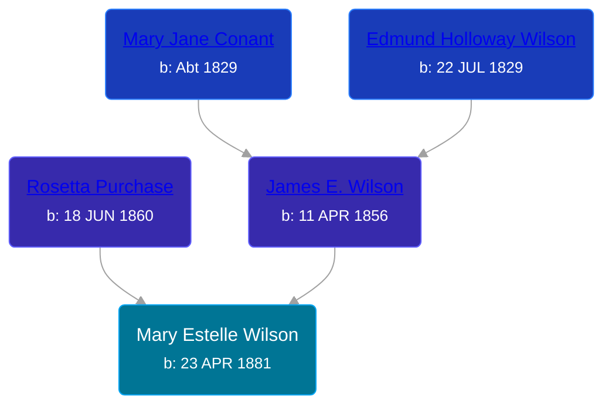

## 🟣 Mary Estelle Wilson
<small>Age: 90y, 6m, 13d</small>

Daughter of [James E. Wilson](/people/5/54950695) and [Rosetta Purchase](/people/2/27770192)





### 📆 Events


Type | Date | Age at Event | Place
------ | ------ | ------ | ------
Birth | 23 APR 1881 |  |
[Death](#event-event-3) | 06 NOV 1971 | 90y, 6m, 13d | Sparta, Kent, Michigan, USA
Burial |  |  | Alpine Cemetery, Comstock Park, Kent, Michigan, USA



- **Birth**
**Date**: 23 APR 1881, Age:
**Place**:
- **[Death](#event-event-3)**
**Date**: 06 NOV 1971, Age: 90y, 6m, 13d
**Place**: Sparta, Kent, Michigan, USA
- **Burial**
**Date**:
**Place**: Alpine Cemetery, Comstock Park, Kent, Michigan, USA


## 👩‍❤️‍👨 Relationships

### 🔵 [Clarence D. Whiting](/people/6/66611984), b. 17 FEB 1883

#### Children With Clarence D. Whiting
* 🔵 [Living Person](/people/2/23622077)
* 🔵 [Living Person](/people/5/51690710)
### 🔵 [Eldridge Vincent Anson](/people/2/29601540), b. 02 NOV 1877

#### Events


Type | Date | Age at Event | Place
------ | ------ | ------ | ------
[Marriage](#event-family-1-event-0) | 04 JUL 1901 | 20y, 2m, 11d | White Cloud, Newaygo, Michigan, USA



- **[Marriage](#event-family-1-event-0)**
**Date**: 04 JUL 1901, Age: 20y, 2m, 11d
**Place**: White Cloud, Newaygo, Michigan, USA


#### Children With Eldridge Vincent Anson
* 🔵 [Eldridge Lionel Anson](/people/2/23048123), b. 17 APR 1902
* 🔵 [Hildreth LaVere Anson](/people/8/87733546), b. 04 SEP 1904
### 📰 Event Sources

####  Marriage, 04 JUL 1901
* Michigan, Marriage Records, 1867-1952
>   
  > Name:Mary Wilson  
  > Gender:Female  
  > Race:White  
  > Birth Year:abt 1881  
  > Birth Place:Michigan  
  > Marriage Date:4 Jul 1901  
  > Marriage Place:White Cloud, Newaygo, Michigan, USA  
  > Age:20  
  > Residence Place:Biteley  
  > Father:James Wilson  
  > Spouse:Eldridge Anson  
  > Gender:Male  
  > Race:White  
  > Birth Year:abt 1877  
  > Birth Place:Minnesota  
  > Age:24  
  > Residence Place:Troy  
  > Father:George Anson  
  > Mother:Huldah Blowers  
  > Record Number:2230  
  > Film:72  
  > Film Description:1901 Lapeer - 1901 St Joseph

####  Death, 06 NOV 1971
* Michigan, Death Records, 1867-1950
>   
  > Name:  Mary E Whiting  
  > Birth Date: 23 Apr 1981  
  > Death Date: 3 Nov 1971  
  > Gender: Female  
  > Residence: Alpine, Kent, Michigan  
  > Place of Death: Sparta, Kent, Michigan
* The Grand Rapids Press
>   
  > WHITING - Mrs. Mary E. Whiting, aged 90, of 323 Stowell, Comstock Park, passed away Wednesday at a local nursing home. She is survived by four sons, Eldridge Anson and Vernon Whiting of Muskegon, Hildreth Anson of White Cloud, James Whiting of Rockford; nine grandchildren; 18 great-grandchildren; one sister, Mrs. Hanna Bowman of Grand Rapids; one brother, Gene Wilson of Fremont; several nieces and nephews. Funeral services will be held Monday 2 p.m. at the Hessel-Cheslek Funeral Home with Rev. Paul Patterson officiating. Interment Alpine  
  > Cemetery. Friends may call at the chapel.
