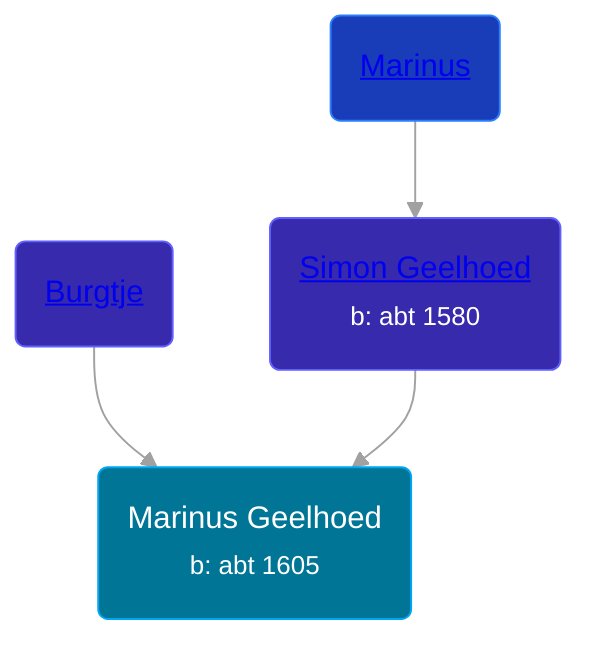

## 🔵 Marinus Geelhoed
<small>Age: 39y, 3m, 28d</small>

Son of [Simon Geelhoed](/people/7/784264) and [Burgtje ](/people/1/19894026)





### 📆 Events


Type | Date | Age at Event | Place
------ | ------ | ------ | ------
[Birth](#event-event-2) | abt 1605 |  |
[Death](#event-event-3) | 28 MAR 1644 | 39y, 3m, 28d |



- **[Birth](#event-event-2)**
**Date**: abt 1605, Age:
**Place**:
- **[Death](#event-event-3)**
**Date**: 28 MAR 1644, Age: 39y, 3m, 28d
**Place**:


## 👩‍❤️‍👨 Relationships

### 🟣 [Leyntje Pietersdochter](/people/3/34853086), b. abt 1605

#### Children With Leyntje Pietersdochter
* 🔵 [Maarten Geelhoed](/people/7/7846330), b. 04 MAR 1640
### 📰 Event Sources

####  Birth, abt 1605
* Geelhoet, Geelhoed & Geelhoedt Genealogie

####  Death, 28 MAR 1644
* Geelhoet, Geelhoed & Geelhoedt Genealogie