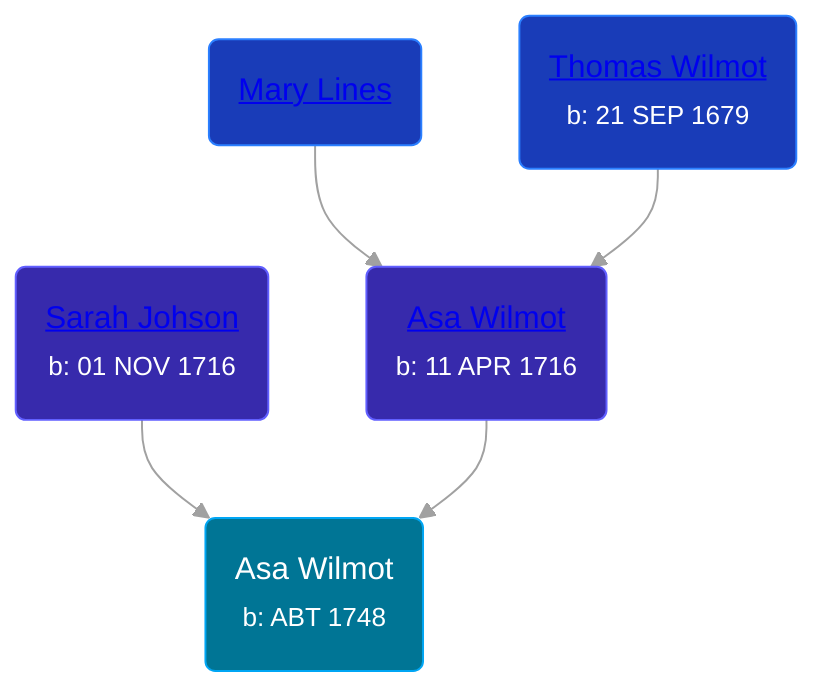

## 🔵 Asa Wilmot

Son of [Asa Wilmot](/people/1/15735504) and [Sarah Johson](/people/4/48968878)





### 📆 Events


Type | Date | Age at Event | Place
------ | ------ | ------ | ------
[Birth](#event-event-2) | ABT 1748 |  |



- **[Birth](#event-event-2)**
**Date**: ABT 1748, Age:
**Place**:


### 📰 Event Sources

####  Birth, ABT 1748
* The New England Historical and Genealogical Register  - 73