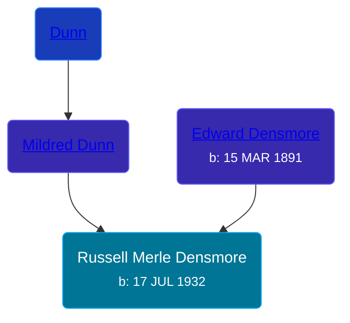

## 🔵 Russell Merle Densmore
<small>Age: 88y, 3m, 12d</small>

Son of [Edward Densmore](/people/7/75117844) and [Mildred Dunn](/people/7/7869963)





### 📆 Events


Type | Date | Age at Event | Place
------ | ------ | ------ | ------
Birth | 17 JUL 1932 |  |
[Death](#event-event-3) | 29 OCT 2020 | 88y, 3m, 12d |



- **Birth**
**Date**: 17 JUL 1932, Age:
**Place**:
- **[Death](#event-event-3)**
**Date**: 29 OCT 2020, Age: 88y, 3m, 12d
**Place**:


## 👩‍❤️‍👨 Relationships

### 🟣 [Living Person](/people/7/7137584)

#### Children With Living Person
* 🟣 [Living Person](/people/6/67186741)
* 🟣 [Living Person](/people/6/6037552)
### 📰 Event Sources

####  Death, 29 OCT 2020
* MLive
>   
  > Densmore, Russell 7/17/1932 - 10/29/2020   
  >   
  > Springport, MI -- Russ was born on July 17, 1932 and he took the checker flag on Oct. 29, 2020. If you knew Russ you knew he loved and lived racing. As a young man he would race at Jackson Speedway. It was in his blood, so much that he decided to build his own Michigan Ideal Speedway. He worked 40 years at Michigan International Speedway (Fire Rescue). Russ was a volunteer firefighter/first responder, and also spent time in law enforcement and built a propane business, Thermogas of Springport. Russ is survived by his wife Pat, having just passed 44 years together. Also surviving are his twin daughters, Joan Densmore (Dutch), June (Rick) Stevens; step-sons, Dave (Kim) Eddy, Steve (Joie) Eddy; grandchildren, Nicky, Richard, Chris, Jenny, Ethan, Abbey, Kim and Donna. He is also survived by several great-grandchildren; sister, Donna (Leon) Hinderer; several nieces and nephews and their spouses. Russ was preceded in death by his parents, Edward and Mildred (Dunn) Densmore; daughter, Dianne Chunko; great-grandsons, Dylan and Colton Aukerman; brothers, Ed (Gwen) and Dale (Betty) Densmore; sisters: Goldie (Earl) Garrison, AnnaBelle (Norris) Reynolds and Helen (Harry) Barton. Funeral services for Russ will be held at 11 a.m. on Wed., Nov. 4, 2020 at the Vickers Springport Funeral Home, with the Rev. Bill Tripp officiating. The family will receive friends on Tue., Nov. 3, 2020 from 2 p.m. to 4 p.m. and 6 p.m. to 8 p.m. and one hour prior to the service at the funeral home. Burial will follow at the Springport Cemetery. Honored to be serving as pallbearers are Steve Eddy, Dave Eddy, Ron Densmore, Richard Yahnka, Ethan Eddy and Shawn McCall, honorary pallbearers will be Curt Ainsworth, Terry Hiither and Rustie Hiither. Arrangements entrusted to the Vickers Springport Funeral Home, 121 Pearl St./P.O. Box 235, Springport, MI 49284. 517-857-4848  
  >   
  > Published by Jackson Citizen Patriot from Oct. 30 to Nov. 1, 2020.
