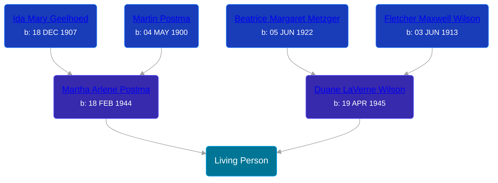

## 🟣 Living Person

Daughter of [Duane LaVerne Wilson](/people/6/61086158) and [Martha Arlene Postma](/people/3/39368292)





## 👩‍❤️‍👨 Relationships

### 🔵 [Living Person](/people/8/89027494)

#### Children With Living Person
* 🟣 [Living Person](/people/5/59787254)
* 🔵 [Living Person](/people/5/54906750)