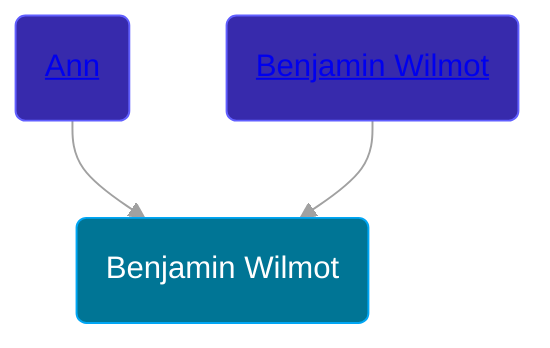

## 🔵 Benjamin Wilmot
<small>Age: undefined</small>

Son of [Benjamin Wilmot](/people/6/61915340) and [Ann ](/people/3/3872021)





### 📆 Events


Type | Date | Age at Event | Place
------ | ------ | ------ | ------
[Death](#event-event-2) | 08 APR 1651 | undefined |



- **[Death](#event-event-2)**
**Date**: 08 APR 1651, Age: undefined
**Place**:


### 📰 Event Sources

####  Death, 08 APR 1651
* The New England Historical and Genealogical Register  - 68