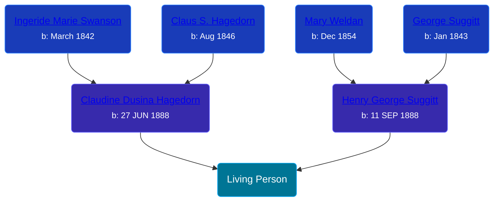

## 🟣 Living Person

Daughter of [Henry George Suggitt](/people/7/7271894) and [Claudine Dusina Hagedorn](/people/2/21896640)



```mermaid
graph
classDef grands fill:#193cb8,stroke:#2b7fff,stroke-width:1px,color:#fff;
classDef parents fill:#372aac,stroke:#615fff,stroke-width:1px,color:#fff;
classDef primary fill:#007595,stroke:#00a6f4,stroke-width:1px,color:#fff;
4805871(Living Person):::primary
21896640(<a class="text-white" href="/people/2/21896640">Claudine Dusina Hagedorn</a><br /><small>b: 27 JUN 1888</small>):::parents-->4805871
41786466(<a class="text-white" href="/people/4/41786466">Ingeride Marie Swanson</a><br /><small>b: March 1842</small>):::grands-->21896640
89695136(<a class="text-white" href="/people/8/89695136">Claus S. Hagedorn</a><br /><small>b: Aug 1846</small>):::grands-->21896640
7271894(<a class="text-white" href="/people/7/7271894">Henry George Suggitt</a><br /><small>b: 11 SEP 1888</small>):::parents-->4805871
18538354(<a class="text-white" href="/people/1/18538354">Mary Weldan</a><br /><small>b: Dec 1854</small>):::grands-->7271894
48171276(<a class="text-white" href="/people/4/48171276">George Suggitt</a><br /><small>b: Jan 1843</small>):::grands-->7271894
```


## 👩‍❤️‍👨 Relationships

### 🔵 [Living Person](/people/5/51686954)
