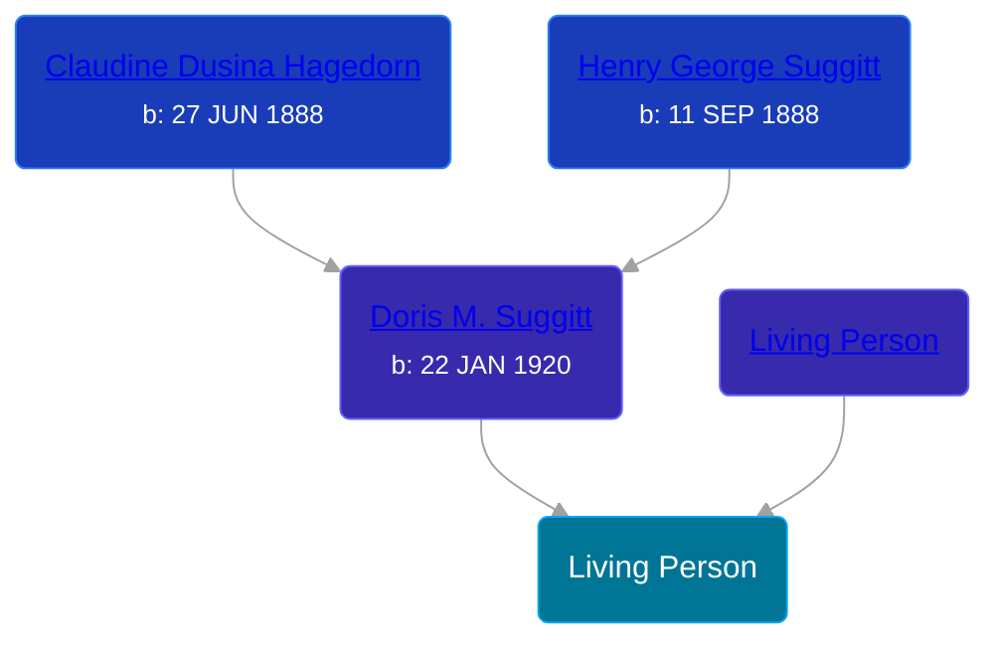

## 🟣 Living Person

Daughter of [Living Person](/people/5/5859459) and [Doris M. Suggitt](/people/6/62856138)



```mermaid
graph
classDef grands fill:#193cb8,stroke:#2b7fff,stroke-width:1px,color:#fff;
classDef parents fill:#372aac,stroke:#615fff,stroke-width:1px,color:#fff;
classDef primary fill:#007595,stroke:#00a6f4,stroke-width:1px,color:#fff;
48466912(Living Person):::primary
62856138(<a class="text-white" href="/people/6/62856138">Doris M. Suggitt</a><br /><small>b: 22 JAN 1920</small>):::parents-->48466912
21896640(<a class="text-white" href="/people/2/21896640">Claudine Dusina Hagedorn</a><br /><small>b: 27 JUN 1888</small>):::grands-->62856138
7271894(<a class="text-white" href="/people/7/7271894">Henry George Suggitt</a><br /><small>b: 11 SEP 1888</small>):::grands-->62856138
5859459(<a class="text-white" href="/people/5/5859459">Living Person</a>):::parents-->48466912
linkStyle default stroke:#a1a1a1
```

