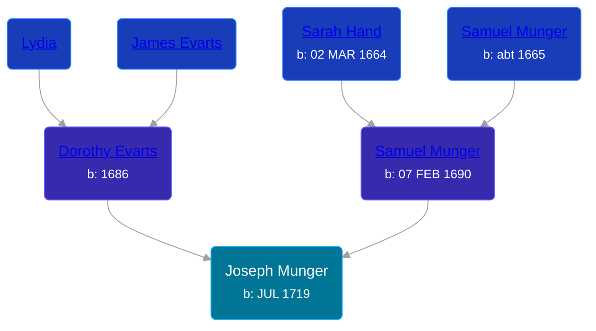

## 🔵 Joseph Munger
<small>Age: 85y, 5m</small>

Son of [Samuel Munger](/people/6/64239804) and [Dorothy Evarts](/people/5/59501816)





### 📆 Events


Type | Date | Age at Event | Place
------ | ------ | ------ | ------
[Birth](#event-event-2) | JUL 1719 |  | Hampton, Connecticut, USA
[Death](#event-event-3) | 1805 | 85y, 5m | Paris, New York, USA



- **[Birth](#event-event-2)**
**Date**: JUL 1719, Age:
**Place**: Hampton, Connecticut, USA
- **[Death](#event-event-3)**
**Date**: 1805, Age: 85y, 5m
**Place**: Paris, New York, USA


### 📰 Event Sources

####  Birth, JUL 1719
* The Munger Book  - 204

####  Death, 1805
* The History of Ludlow, Massachusetts  - 429
* The Munger Book  - 216