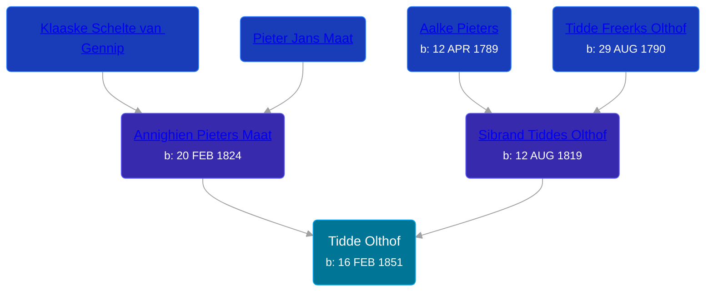

## 🔵 Tidde Olthof

Son of [Sibrand Tiddes Olthof](/people/7/76433820) and [Annighien Pieters Maat](/people/7/7249878)





### 📆 Events


Type | Date | Age at Event | Place
------ | ------ | ------ | ------
[Birth](#event-event-2) | 16 FEB 1851 |  | Loppersum, Netherlands



- **[Birth](#event-event-2)**
**Date**: 16 FEB 1851, Age:
**Place**: Loppersum, Netherlands


### 📰 Event Sources

####  Birth, 16 FEB 1851
* Dutch Civil Register
>   
  > Child: Tidde Olthof  
  > Gender: Male  
  > Place of birth: Loppersum  
  > Date of birth: Sunday, February 16, 1851  
  > Father: Sibrand Tiddes Olthof  
  > Age: 31  
  > Occupation: dagloner  
  > Mother: Annichien Pieters Maat  
  > Event: Geboorte  
  > Date: Sunday, February 16, 1851  
  > Event place: Loppersum