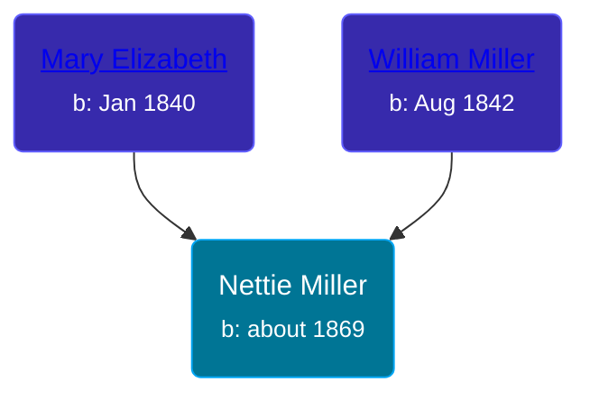

## 🟣 Nettie Miller

Daughter of [William Miller](/people/1/1014217) and [Mary Elizabeth](/people/8/84477504)





### 📆 Events


Type | Date | Age at Event | Place
------ | ------ | ------ | ------
Birth | about 1869 |  | Indiana, USA
[Residence](#event-event-0) | 1870 | 1y | Coesse, Whitley, Indiana, USA
[Residence](#event-event-1) | 1880 | 11y | Richland, Whitley, Indiana, USA



- **Birth**
**Date**: about 1869, Age:
**Place**: Indiana, USA
- **[Residence](#event-event-0)**
**Date**: 1870, Age: 1y
**Place**: Coesse, Whitley, Indiana, USA
- **[Residence](#event-event-1)**
**Date**: 1880, Age: 11y
**Place**: Richland, Whitley, Indiana, USA


### 📰 Event Sources

####  Residence, 1870
* 1870 US Census

####  Residence, 1880
* 1880 US Census
