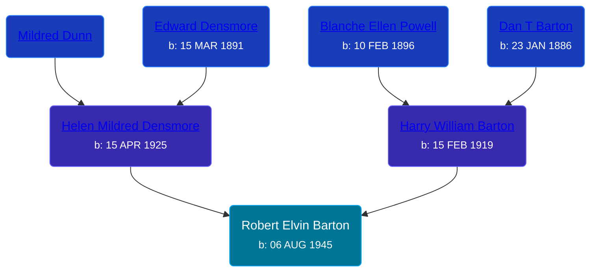

## 🔵 Robert Elvin Barton
<small>Age: 76y, 5m, 26d</small>

Son of [Harry William Barton](/people/8/83492690) and [Helen Mildred Densmore](/people/5/54702290)





### 📆 Events


Type | Date | Age at Event | Place
------ | ------ | ------ | ------
Birth | 06 AUG 1945 |  |
[Residence](#event-event-0) | 13 APR 1950 | 4y, 8m, 7d | Norvell Township, Jackson, Michigan, USA
Death | 02 FEB 2022 | 76y, 5m, 26d | Michigan, USA



- **Birth**
**Date**: 06 AUG 1945, Age:
**Place**:
- **[Residence](#event-event-0)**
**Date**: 13 APR 1950, Age: 4y, 8m, 7d
**Place**: Norvell Township, Jackson, Michigan, USA
- **Death**
**Date**: 02 FEB 2022, Age: 76y, 5m, 26d
**Place**: Michigan, USA


## 👩‍❤️‍👨 Relationships

### ⚪ Unknown Person

#### Children With Unknown Person
* 🔵 [Living Person](/people/5/55705994)
### 📰 Event Sources

####  Residence, 13 APR 1950
* 1950 US Census
>   
  > Name: Robert E Barton  
  > Sex: Male  
  > Age: 4 years  
  > Birth Year (Estimated): 1946  
  > Birthplace: Michigan  
  > Marital Status: Single  
  > Race: W  
  > Relationship to Head of Household: Son  
  > Event Date: 12 April 1950  
  > Event Place: Norvell, Norvell Township, Jackson, Michigan, United States  
  > Event Place (Original): Norvell, Jackson, Michigan  
  > Enumeration District: 38-122  
  > Line Number: 4  
  > Page Number: 13  
  >   
  > Harry W Barton, Head, 31 years, Michigan  
  > Helen M Barton, Wife, 24 years, Michigan  
  > Harry W Barton, Jr, Son, 5 years, Michigan  
  > Robert E Barton, Son, 4 years, Michigan  
  > Richard D Barton, Son, 0 years, Michigan  
  >
