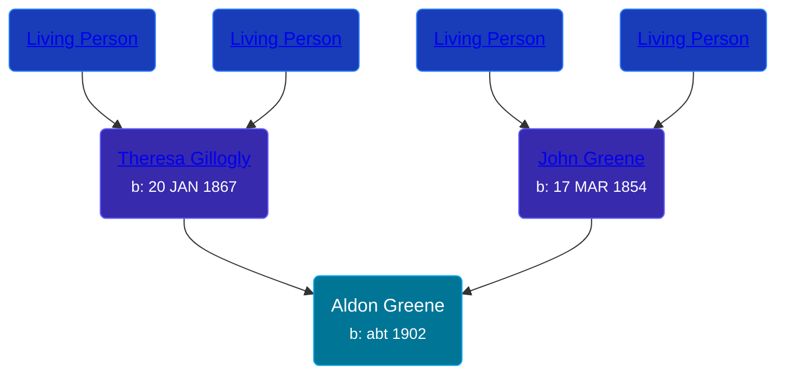

## 🔵 Aldon Greene
<small>Age: 27y, 1m, 19d</small>

Son of [John Greene](/people/7/71088434) and [Theresa Gillogly](/people/6/67581747)





### 📆 Events


Type | Date | Age at Event | Place
------ | ------ | ------ | ------
Birth | abt 1902 |  | Michigan, USA
[Residence](#event-event-0) | 21 APR 1910 | 8y, 4m, 21d | Owosso, Shiawassee, Michigan, USA
[Residence](#event-event-1) | 17 JAN 1920 | 18y, 1m, 17d | Owosso, Shiawassee, Michigan, USA
[Death](#event-event-5) | 19 JAN 1929 | 27y, 1m, 19d | Owosso, Shiawassee, Michigan, USA



- **Birth**
**Date**: abt 1902, Age:
**Place**: Michigan, USA
- **[Residence](#event-event-0)**
**Date**: 21 APR 1910, Age: 8y, 4m, 21d
**Place**: Owosso, Shiawassee, Michigan, USA
- **[Residence](#event-event-1)**
**Date**: 17 JAN 1920, Age: 18y, 1m, 17d
**Place**: Owosso, Shiawassee, Michigan, USA
- **[Death](#event-event-5)**
**Date**: 19 JAN 1929, Age: 27y, 1m, 19d
**Place**: Owosso, Shiawassee, Michigan, USA


### 📰 Event Sources

####  Residence, 21 APR 1910
* 1910 US Census
>   
  > Name: Aldon Green  
  > Age in 1910: 8  
  > Birth Date: 1902  
  > Birthplace: Michigan  
  > Home in 1910: Owosso Ward 5, Shiawassee, Michigan, USA  
  > Sheet Number: 10b  
  > Street: Mack  
  > Race: White  
  > Gender: Male  
  > Relation to Head of House: Son  
  > Marital Status: Single  
  > Father's Birthplace: Canada  
  > Mother's Birthplace: Canada  
  > Enumeration District Number: 0093  
  > Enumerated Year: 1910  
  >   
  > Household members:  
  > - John Green, 65, Head    
  > - Theresa Green, 42, Wife    
  > - Andrew Green, 18, Son    
  > - Leona Green, 14, Daughter    
  > - Theresa Green, 12, Daughter    
  > - Agnes Green, 10, Daughter    
  > - Aldon Green, 8, Son    
  > - Helen Green, 2, Daughter    
  >

####  Residence, 17 JAN 1920
* 1920 US Census
>   
  > Name: Eldred Green  
  > Age: 17  
  > Birth Year: abt 1903  
  > Birthplace: Michigan  
  > Home in 1920: Owosso Ward 5, Shiawassee, Michigan  
  > Street: Wack Street  
  > Residence Date: 1920  
  > Race: White  
  > Gender: Male  
  > Relation to Head of House: Son  
  > Marital Status: Single  
  > Father's Name: Theresa Breen  
  > Father's Birthplace: Canada  
  > Mother's Birthplace: Canada  
  > Able to Speak English: Yes  
  > Occupation: Laborer  
  > Industry: Factory  
  > Employment Field: Wage or Salary  
  > Attended School: No  
  > Able to read: Yes  
  > Able to Write: Yes  
  >   
  > Household members:  
  > - Theresa Green, 57, Head  
  > - Andy Green, 28, Son  
  > - Agnes Green, 19, Daughter  
  > - Eldred Green, 17, Son  
  > - Helen Green, 11, Daughter  
  > - Fred Metzgar, 24, Son-in-law  
  > - Theresa Metzgar, 22, Daughter  
  > - John Metzgar, 1, Grandson  
  >

####  Death, 19 JAN 1929
* Michigan, Death Records, 1867-1950
