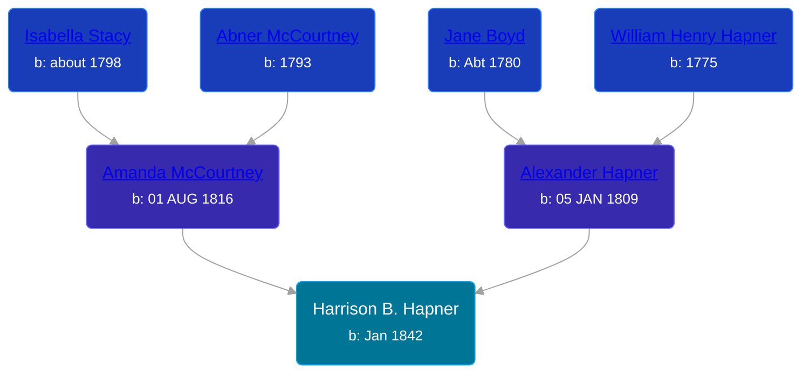

## 🔵 Harrison B. Hapner

Son of [Alexander Hapner](/people/6/68586072) and [Amanda McCourtney](/people/5/56501802)





### 📆 Events


Type | Date | Age at Event | Place
------ | ------ | ------ | ------
Birth | Jan 1842 |  |



- **Birth**
**Date**: Jan 1842, Age:
**Place**:

