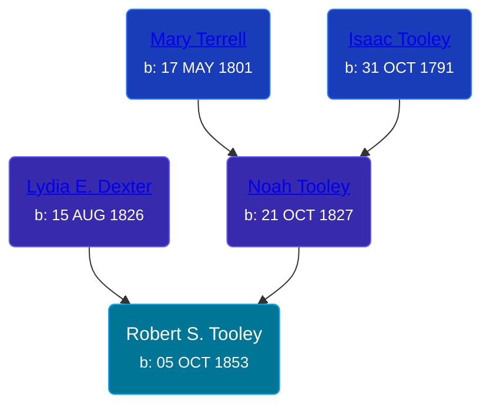

## 🔵 Robert S. Tooley
<small>Age: 87y, 11m, 26d</small>

Son of [Noah Tooley](/people/8/84640933) and [Lydia E. Dexter](/people/6/67357568)





### 📆 Events


Type | Date | Age at Event | Place
------ | ------ | ------ | ------
Birth | 05 OCT 1853 |  | Paris Township, Kent, Michigan, USA
[Residence](#event-event-0) | 23 JUN 1860 | 6y, 8m, 18d | Paris Township, Kent, Michigan, USA
[Residence](#event-event-1) | 12 AUG 1870 | 16y, 10m, 7d | Paris Township, Kent, Michigan, USA
[Residence](#event-event-2) | 1880 | 26y, 1m, 25d | Paris Township, Kent, Michigan, USA
[Death](#event-event-6) | 01 OCT 1941 | 87y, 11m, 26d | Grand Rapids, Kent, Michigan, United States
Burial |  |  | Woodlawn Cemetery, Paris Township, Kent, Michigan, USA



- **Birth**
**Date**: 05 OCT 1853, Age:
**Place**: Paris Township, Kent, Michigan, USA
- **[Residence](#event-event-0)**
**Date**: 23 JUN 1860, Age: 6y, 8m, 18d
**Place**: Paris Township, Kent, Michigan, USA
- **[Residence](#event-event-1)**
**Date**: 12 AUG 1870, Age: 16y, 10m, 7d
**Place**: Paris Township, Kent, Michigan, USA
- **[Residence](#event-event-2)**
**Date**: 1880, Age: 26y, 1m, 25d
**Place**: Paris Township, Kent, Michigan, USA
- **[Death](#event-event-6)**
**Date**: 01 OCT 1941, Age: 87y, 11m, 26d
**Place**: Grand Rapids, Kent, Michigan, United States
- **Burial**
**Date**:
**Place**: Woodlawn Cemetery, Paris Township, Kent, Michigan, USA


### 📰 Event Sources

####  Residence, 23 JUN 1860
* 1860 US Census

####  Residence, 12 AUG 1870
* 1870 US Census

####  Residence, 1880
* 1880 US Census

####  Death, 01 OCT 1941
* Michigan, Death Records, 1867-1950
>   
  > Name: Robert S Tooley  
  > Gender: Male  
  > Marital Status: Widowed  
  > Birth Date: Oct, 1853  
  > Birth Place: Paris Twp Kent County, Michigan  
  > Death Date: 1 Oct 1941  
  > Death Place: Grand Rapids, Kent, Michigan, USA  
  > Death Age: 87  
  > File Number: 035002  
  > Father: Noah Tooley  
  > Mother: Lydia Dexter
* The Grand Rapids Press  - 01 Oct 1941
>   
  > TOOLEY -- Robert S. Tooley, aged 87, passed away Wednesday morning at the home of his daughter, Mrs. G. J. Hesaelink, 926 Grandville av., S.W. He is survived by one other daughter, Mrs. Mattie Heatzelman of Paris Township. The body was removed to the Metcalf Mortuary where services will be held at 2 o'clock Saturday afternoon. Interment in Woodlawn cemetery.
