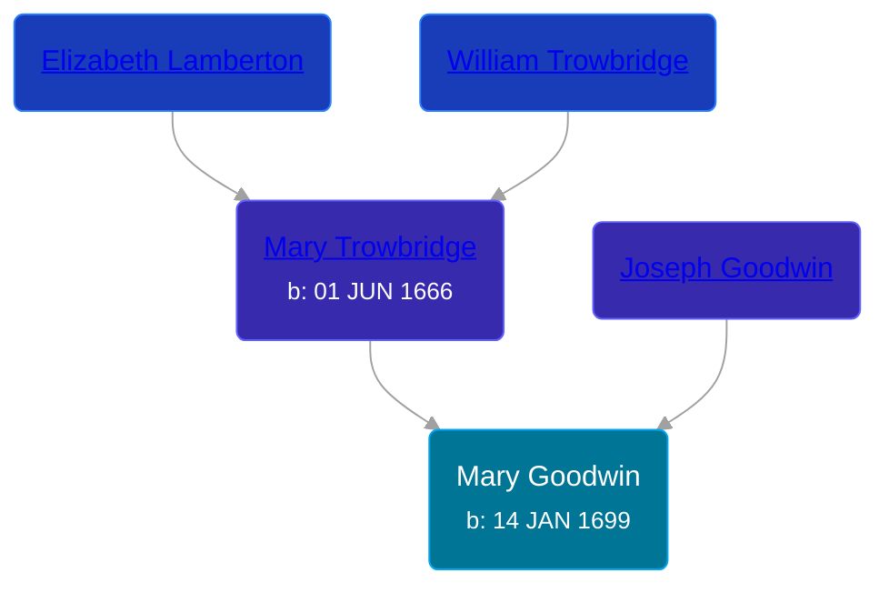

## 🟣 Mary Goodwin

Daughter of [Joseph Goodwin](/people/3/39421908) and [Mary Trowbridge](/people/4/42640832)





### 📆 Events


Type | Date | Age at Event | Place
------ | ------ | ------ | ------
Birth | 14 JAN 1699 |  | Milford, Connecticut, USA



- **Birth**
**Date**: 14 JAN 1699, Age:
**Place**: Milford, Connecticut, USA


## 👩‍❤️‍👨 Relationships

### 🔵 [Josiah Terrill](/people/8/80183041), b. 18 AUG 1695

#### Events


Type | Date | Age at Event | Place
------ | ------ | ------ | ------
[Marriage](#event-family-0-event-0) | 01 JAN 1724 | 24y, 11m, 17d | Milford, Connecticut, USA



- **[Marriage](#event-family-0-event-0)**
**Date**: 01 JAN 1724, Age: 24y, 11m, 17d
**Place**: Milford, Connecticut, USA


#### Children With Josiah Terrill
* 🔵 [Moses Terrill](/people/1/19430220), b. 06 OCT 1724
* 🔵 [Aaron Terrill](/people/2/27846482), b. 23 MAR 1726
* 🟣 [Eunice Terrill](/people/7/78054136), b. 10 MAR 1728
* 🔵 [Oliver Terrill](/people/9/94505283), b. BEF 28 JUN 1730
* 🔵 [Josiah Terrill](/people/1/19227229), b. 12 NOV 1732
* 🔵 [Isaac Terrill](/people/8/80400910), b. 23 SEP 1735
* 🔵 [Isreal Terrill](/people/4/44434844), b. 20 MAR 1737
* 🟣 [Mary Terrill](/people/2/25880120), b. 07 JUL 1741
* 🔵 [Abigail Terrill](/people/9/94050390), b. 16 JAN 1743
### 📰 Event Sources

####  Marriage, 01 JAN 1724
* Roger and Abigail (Ufford) Terrill and Some Descendants: 1632 - 1993  - 22
* The Town and City of Waterbury, Connecticut  - 135