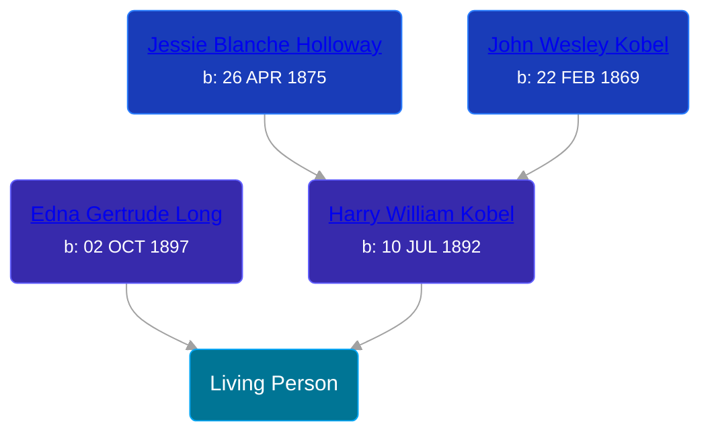

## 🟣 Living Person

Daughter of [Harry William Kobel](/people/3/30496161) and [Edna Gertrude Long](/people/3/33710863)



```mermaid
graph
classDef grands fill:#193cb8,stroke:#2b7fff,stroke-width:1px,color:#fff;
classDef parents fill:#372aac,stroke:#615fff,stroke-width:1px,color:#fff;
classDef primary fill:#007595,stroke:#00a6f4,stroke-width:1px,color:#fff;
49691942(Living Person):::primary
33710863(<a class="text-white" href="/people/3/33710863">Edna Gertrude Long</a><br /><small>b: 02 OCT 1897</small>):::parents-->49691942
30496161(<a class="text-white" href="/people/3/30496161">Harry William Kobel</a><br /><small>b: 10 JUL 1892</small>):::parents-->49691942
29242864(<a class="text-white" href="/people/2/29242864">Jessie Blanche Holloway</a><br /><small>b: 26 APR 1875</small>):::grands-->30496161
24649136(<a class="text-white" href="/people/2/24649136">John Wesley Kobel</a><br /><small>b: 22 FEB 1869</small>):::grands-->30496161
linkStyle default stroke:#a1a1a1
```

