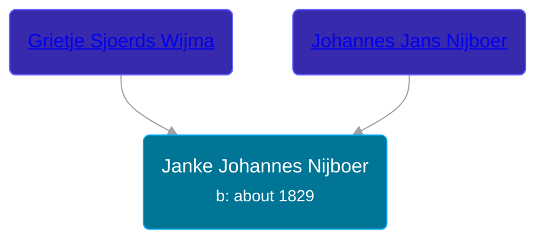

## 🟣 Janke Johannes Nijboer
<small>Age: 72y, 6m, 20d</small>

Daughter of [Johannes Jans Nijboer](/people/5/51339263) and [Grietje Sjoerds Wijma](/people/8/88030934)





### 📆 Events


Type | Date | Age at Event | Place
------ | ------ | ------ | ------
Birth | about 1829 |  |
[Death](#event-event-4) | 20 JUN 1901 | 72y, 6m, 20d | Grootegast, Netherlands



- **Birth**
**Date**: about 1829, Age:
**Place**:
- **[Death](#event-event-4)**
**Date**: 20 JUN 1901, Age: 72y, 6m, 20d
**Place**: Grootegast, Netherlands


## 👩‍❤️‍👨 Relationships

### 🔵 [Wolter Eintes Postma](/people/7/78693659), b. 05 AUG 1825

#### Events


Type | Date | Age at Event | Place
------ | ------ | ------ | ------
[Marriage](#event-family-0-event-0) | 30 APR 1853 | 24y, 4m, 30d | Achtkarspelen, Netherlands



- **[Marriage](#event-family-0-event-0)**
**Date**: 30 APR 1853, Age: 24y, 4m, 30d
**Place**: Achtkarspelen, Netherlands


### 📰 Event Sources

####  Marriage, 30 APR 1853
* Dutch Civil Register

####  Death, 20 JUN 1901
* Dutch Civil Register
>   
  > Source Civil register - Death  
  > Archive location: Groninger Archieven  
  > General Municipality: Grootegast  
  > Type of record: overlijden  
  > Record number: 72  
  > Registration date: 20-06-1901  
  > Deceased: Janke Nijboer  
  > Gender: V  
  > Date of death: 20-06-1901  
  > Age: 73  
  > Place of death: Grootegast  
  > Father: Johannes Jans Nijboer  
  > Mother: Grietje Sjoerds Wijma  
  > Partner: Wolter Eintes Postma  
  > Relationship: weduwe  
  > Additional information: geboortepl: Surhuisterveen, gem.Achtkarspelen;beroep overl.: arbeidster