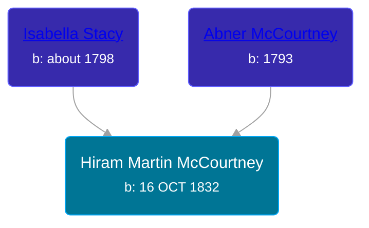

## 🔵 Hiram Martin McCourtney
<small>Age: 77y, 6m, 20d</small>

Son of [Abner McCourtney](/people/7/72592264) and [Isabella Stacy](/people/9/91476553)





### 📆 Events


Type | Date | Age at Event | Place
------ | ------ | ------ | ------
[Birth](#event-event-2) | 16 OCT 1832 |  | Ohio, USA
[Residence](#event-event-0) | 24 SEP 1850 | 17y, 11m, 8d | Jackson, Kosciusko, Indiana, USA
[Death](#event-event-4) | 06 MAY 1910 | 77y, 6m, 20d | Reed City, Osceola, Michigan, USA



- **[Birth](#event-event-2)**
**Date**: 16 OCT 1832, Age:
**Place**: Ohio, USA
- **[Residence](#event-event-0)**
**Date**: 24 SEP 1850, Age: 17y, 11m, 8d
**Place**: Jackson, Kosciusko, Indiana, USA
- **[Death](#event-event-4)**
**Date**: 06 MAY 1910, Age: 77y, 6m, 20d
**Place**: Reed City, Osceola, Michigan, USA


### 📰 Event Sources

####  Birth, 16 OCT 1832
* Michigan, Death Records, 1867-1950

####  Residence, 24 SEP 1850
* 1850 US Census
>   
  > Name: Hiram McCortney  
  > Gender: Male  
  > Race: White  
  > Age: 17  
  > Birth Year: abt 1833  
  > Birthplace: Ohio  
  > Home in 1850: Jackson, Kosciusko, Indiana, USA  
  > Occupation: Farmer  
  > Industry: Agriculture  
  > Attended School: Yes  
  > Line Number: 27  
  > Dwelling Number: 66  
  > Family Number: 66  
  > Inferred Father:   
  > Abner McCortney  
  > Inferred Mother:   
  > Isabella McCortney

####  Death, 06 MAY 1910
* Michigan, Death Records, 1867-1950
>   
  > Name: Hiram Martin McCourtney  
  > Gender: Male  
  > Race: White  
  > Marital Status: Married  
  > Death Age: 77  
  > Birth Date: 16 Oct 1832  
  > Birth Place: Ohio  
  > Death Date: 6 May 1910  
  > Death Place: Reed City, Osceola, Michigan, USA  
  > Father: Abner McCourtney  
  > Mother: Isabella Stacey