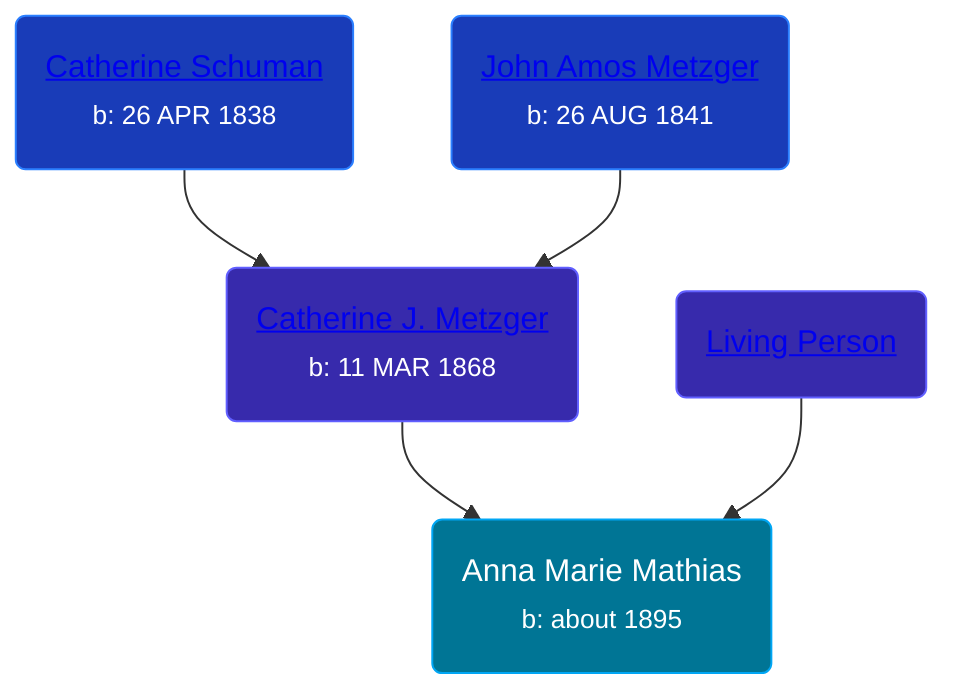

## 🟣 Anna Marie Mathias

Daughter of [Living Person](/people/2/25073708) and [Catherine J. Metzger](/people/6/62700864)





### 📆 Events


Type | Date | Age at Event | Place
------ | ------ | ------ | ------
Birth | about 1895 |  | Indiana, USA



- **Birth**
**Date**: about 1895, Age:
**Place**: Indiana, USA


## 👩‍❤️‍👨 Relationships

### 🔵 [Alonzo LeRoy Ditton](/people/8/83243356), b. about 1891

#### Events


Type | Date | Age at Event | Place
------ | ------ | ------ | ------
[Marriage](#event-family-0-event-0) | 01 OCT 1913 | 18y, 10m, 1d | Hillsdale, Hillsdale, Michigan, USA



- **[Marriage](#event-family-0-event-0)**
**Date**: 01 OCT 1913, Age: 18y, 10m, 1d
**Place**: Hillsdale, Hillsdale, Michigan, USA


### 📰 Event Sources

####  Marriage, 01 OCT 1913
* Michigan, Marriage Records, 1867-1952
>   
  > Name:Anna Marie Mathias  
  > Gender:Female  
  > Race:White  
  > Birth Year:abt 1895  
  > Birth Place:Indiana  
  > Marriage Date:1 Oct 1913  
  > Marriage Place:Hillsdale, Hillsdale, Michigan, USA  
  > Age:18  
  > Residence Place:Columbia City, Indiana  
  > Father:Henry Mathias  
  > Mother:Katie Metzger  
  > Spouse:Alanzo Le Roy Ditton  
  > Gender:Male  
  > Race:White  
  > Birth Year:abt 1891  
  > Birth Place:Indiana  
  > Age:22  
  > Residence Place:Fort Wayne, Indiana  
  > Father:George Ditton  
  > Mother:Almeda Roberts  
  > Record Number:8124  
  > Film:114  
  > Film Description:1913 Gogebic - 1913 Leelanau