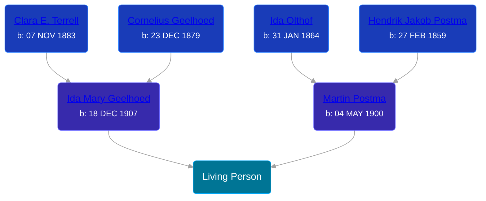

## 🔵 Living Person

Son of [Martin Postma](/people/7/7474832) and [Ida Mary Geelhoed](/people/1/11612484)





## 👩‍❤️‍👨 Relationships

### 🟣 [Lois van der Wall](/people/8/81889469), b. abt 1941

#### Children With Lois van der Wall
* 🔵 [Living Person](/people/5/55112968)
* 🟣 [Living Person](/people/5/53446799)
* 🔵 [Living Person](/people/2/20328096)
* 🟣 [Living Person](/people/5/54914362)
* 🟣 [Living Person](/people/7/78666436)