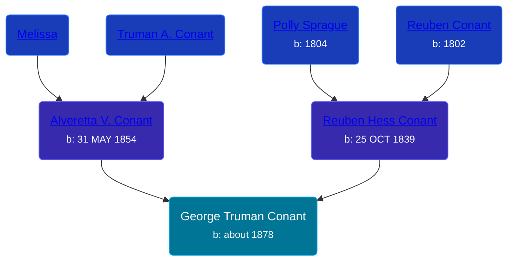

## 🔵 George Truman Conant

Son of [Reuben Hess Conant](/people/3/37326838) and [Alveretta V. Conant](/people/6/60109856)





### 📆 Events


Type | Date | Age at Event | Place
------ | ------ | ------ | ------
Birth | about 1878 |  | Michigan, USA
[Residence](#event-event-0) | June 1880 | 2y, 6m | Robinson Township, Ottawa, Michigan, USA



- **Birth**
**Date**: about 1878, Age:
**Place**: Michigan, USA
- **[Residence](#event-event-0)**
**Date**: June 1880, Age: 2y, 6m
**Place**: Robinson Township, Ottawa, Michigan, USA


### 📰 Event Sources

####  Residence, June 1880
* 1880 US Census
