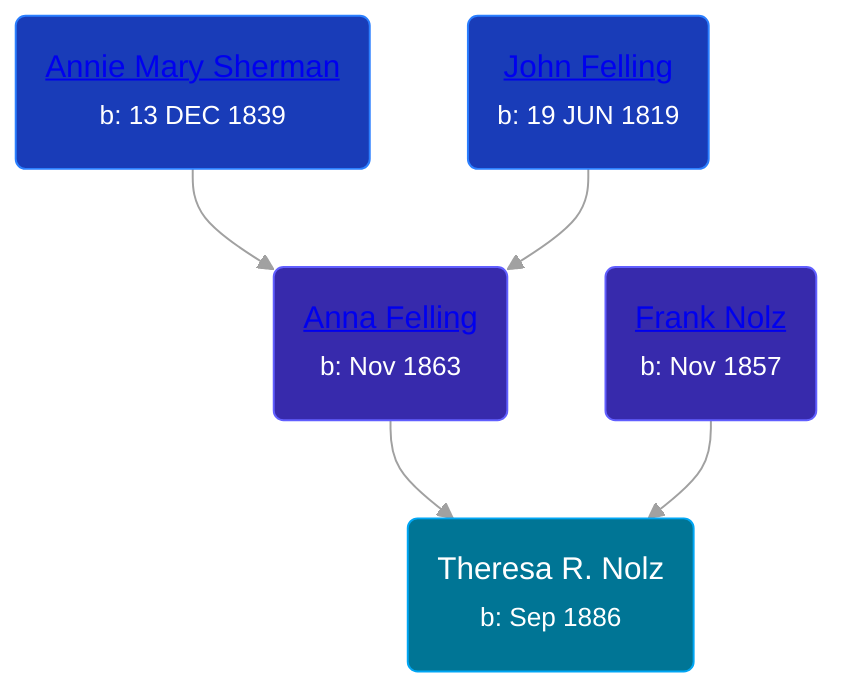

## 🟣 Theresa R. Nolz

Daughter of [Frank Nolz](/people/6/61628928) and [Anna Felling](/people/1/1735561)





### 📆 Events


Type | Date | Age at Event | Place
------ | ------ | ------ | ------
Birth | Sep 1886 |  | Minnesota, USA
[Residence](#event-event-0) | 12 JUN 1895 | 8y, 9m, 12d | St Paul, Ramsey, Minnesota, USA
[Residence](#event-event-1) | 06 JUN 1900 | 13y, 9m, 6d | St Paul, Ramsey, Minnesota, USA
[Residence](#event-event-2) | 02 MAY 1910 | 23y, 8m, 2d | St Paul, Ramsey, Minnesota, USA



- **Birth**
**Date**: Sep 1886, Age:
**Place**: Minnesota, USA
- **[Residence](#event-event-0)**
**Date**: 12 JUN 1895, Age: 8y, 9m, 12d
**Place**: St Paul, Ramsey, Minnesota, USA
- **[Residence](#event-event-1)**
**Date**: 06 JUN 1900, Age: 13y, 9m, 6d
**Place**: St Paul, Ramsey, Minnesota, USA
- **[Residence](#event-event-2)**
**Date**: 02 MAY 1910, Age: 23y, 8m, 2d
**Place**: St Paul, Ramsey, Minnesota, USA


### 📰 Event Sources

####  Residence, 12 JUN 1895
* 1895 Minnesota State Census

####  Residence, 06 JUN 1900
* 1900 US Census

####  Residence, 02 MAY 1910
* 1910 US Census
