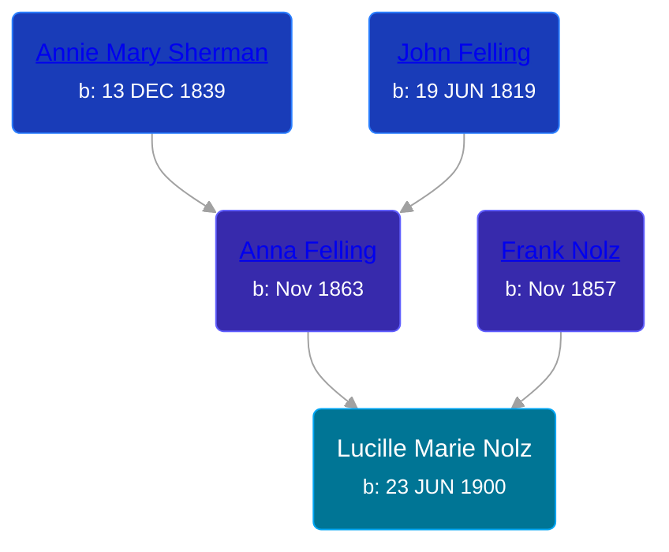

## 🟣 Lucille Marie Nolz

Daughter of [Frank Nolz](/people/6/61628928) and [Anna Felling](/people/1/1735561)





### 📆 Events


Type | Date | Age at Event | Place
------ | ------ | ------ | ------
[Birth](#event-event-2) | 23 JUN 1900 |  | St Paul, Ramsey, Minnesota, USA
[Residence](#event-event-0) | 02 MAY 1910 | 9y, 10m, 9d | St Paul, Ramsey, Minnesota, USA
[Residence](#event-event-1) | 13 JAN 1920 | 19y, 6m, 20d | St Paul, Ramsey, Minnesota, USA



- **[Birth](#event-event-2)**
**Date**: 23 JUN 1900, Age:
**Place**: St Paul, Ramsey, Minnesota, USA
- **[Residence](#event-event-0)**
**Date**: 02 MAY 1910, Age: 9y, 10m, 9d
**Place**: St Paul, Ramsey, Minnesota, USA
- **[Residence](#event-event-1)**
**Date**: 13 JAN 1920, Age: 19y, 6m, 20d
**Place**: St Paul, Ramsey, Minnesota, USA


## 👩‍❤️‍👨 Relationships

### 🔵 [Harold J. Holliday](/people/6/60227815), b. 1898

#### Events


Type | Date | Age at Event | Place
------ | ------ | ------ | ------
[Marriage](#event-family-0-event-0) | 08 OCT 1920 | 20y, 3m, 15d | Glendive, Dawson, Montana, USA



- **[Marriage](#event-family-0-event-0)**
**Date**: 08 OCT 1920, Age: 20y, 3m, 15d
**Place**: Glendive, Dawson, Montana, USA


### 📰 Event Sources

####  Birth, 23 JUN 1900
* Minnesota, Birth Index, 1900-1934

####  Residence, 02 MAY 1910
* 1910 US Census

####  Residence, 13 JAN 1920
* 1920 US Census
####  Marriage, 08 OCT 1920
* Montana, County Marriages, 1865-1950
