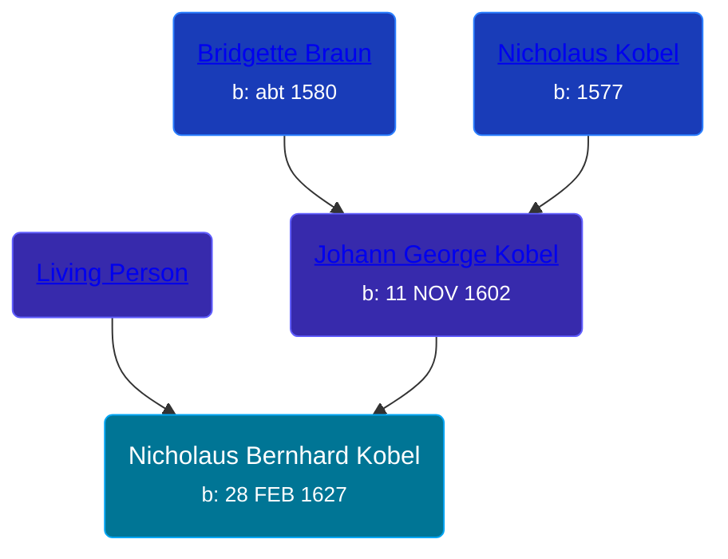

## 🔵 Nicholaus Bernhard Kobel
<small>Age: 70y, 9m, 2d</small>

Son of [Johann George Kobel](/people/1/13002801) and [Living Person](/people/1/19897612)





### 📆 Events


Type | Date | Age at Event | Place
------ | ------ | ------ | ------
Birth | 28 FEB 1627 |  | Nordlengen, Donauworth, Germany
Death | 1698 | 70y, 9m, 2d |



- **Birth**
**Date**: 28 FEB 1627, Age:
**Place**: Nordlengen, Donauworth, Germany
- **Death**
**Date**: 1698, Age: 70y, 9m, 2d
**Place**:


## 👩‍❤️‍👨 Relationships

### 🟣 [Anna Marie Strum](/people/7/70388532), b. 1632

#### Children With Anna Marie Strum
* 🔵 [Johann George Kobel](/people/9/96923637), b. 03 OCT 1656