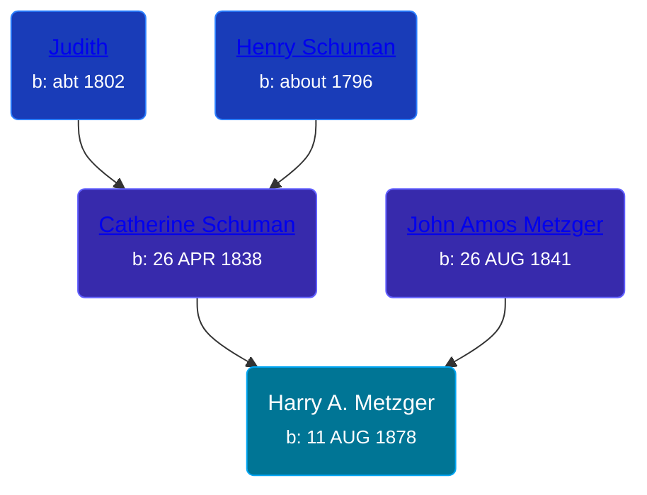

## 🔵 Harry A. Metzger

Son of [John Amos Metzger](/people/2/28893894) and [Catherine Schuman](/people/3/39599940)





### 📆 Events


Type | Date | Age at Event | Place
------ | ------ | ------ | ------
Birth | 11 AUG 1878 |  | Whitley, Indiana, USA
[Residence](#event-event-0) | 1880 | 1y, 3m, 19d | Richland, Whitley, Indiana, USA



- **Birth**
**Date**: 11 AUG 1878, Age:
**Place**: Whitley, Indiana, USA
- **[Residence](#event-event-0)**
**Date**: 1880, Age: 1y, 3m, 19d
**Place**: Richland, Whitley, Indiana, USA


## 👩‍❤️‍👨 Relationships

### 🟣 [Living Person](/people/1/10360736)

### 📰 Event Sources

####  Residence, 1880
* 1880 US Census
