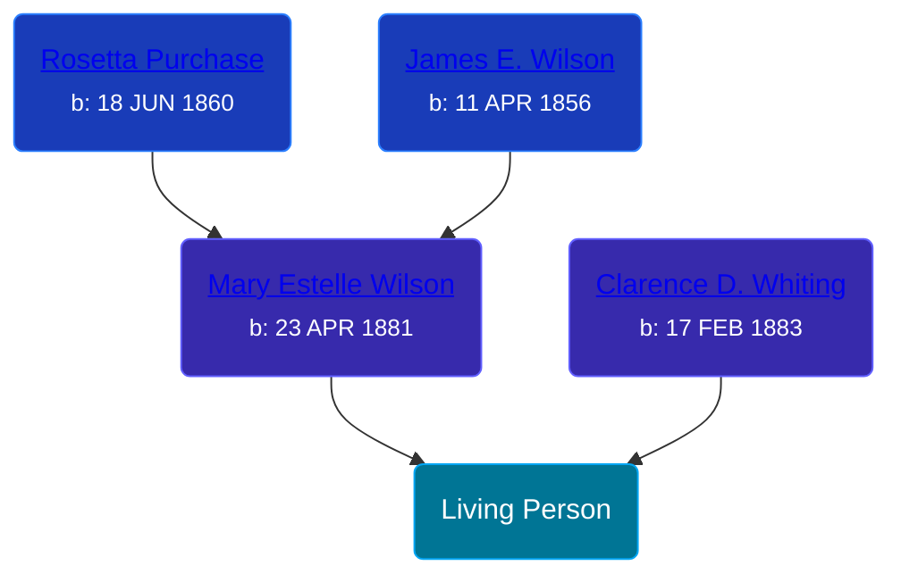

## 🔵 Living Person

Son of [Clarence D. Whiting](/people/6/66611984) and [Mary Estelle Wilson](/people/4/46787428)



```mermaid
graph
classDef grands fill:#193cb8,stroke:#2b7fff,stroke-width:1px,color:#fff;
classDef parents fill:#372aac,stroke:#615fff,stroke-width:1px,color:#fff;
classDef primary fill:#007595,stroke:#00a6f4,stroke-width:1px,color:#fff;
51690710(Living Person):::primary
46787428(<a class="text-white" href="/people/4/46787428">Mary Estelle Wilson</a><br /><small>b: 23 APR 1881</small>):::parents-->51690710
27770192(<a class="text-white" href="/people/2/27770192">Rosetta Purchase</a><br /><small>b: 18 JUN 1860</small>):::grands-->46787428
54950695(<a class="text-white" href="/people/5/54950695">James E. Wilson</a><br /><small>b: 11 APR 1856</small>):::grands-->46787428
66611984(<a class="text-white" href="/people/6/66611984">Clarence D. Whiting</a><br /><small>b: 17 FEB 1883</small>):::parents-->51690710
```

