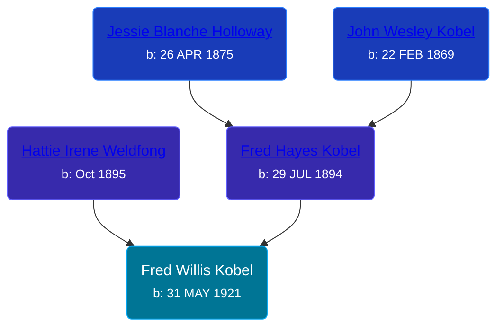

## 🔵 Fred Willis Kobel
<small>Age: 52y, 5m, 24d</small>

Son of [Fred Hayes Kobel](/people/1/1672312) and [Hattie Irene Weldfong](/people/5/59131944)





### 📆 Events


Type | Date | Age at Event | Place
------ | ------ | ------ | ------
[Birth](#event-event-2) | 31 MAY 1921 |  | Warner Township, Antrim, Michigan, USA
[Death](#event-event-3) | 25 NOV 1973 | 52y, 5m, 24d | Gaylord, Otsego, Michigan, USA



- **[Birth](#event-event-2)**
**Date**: 31 MAY 1921, Age:
**Place**: Warner Township, Antrim, Michigan, USA
- **[Death](#event-event-3)**
**Date**: 25 NOV 1973, Age: 52y, 5m, 24d
**Place**: Gaylord, Otsego, Michigan, USA


### 📰 Event Sources

####  Birth, 31 MAY 1921
* Ron Wilson's Research

####  Death, 25 NOV 1973
* Ron Wilson's Research