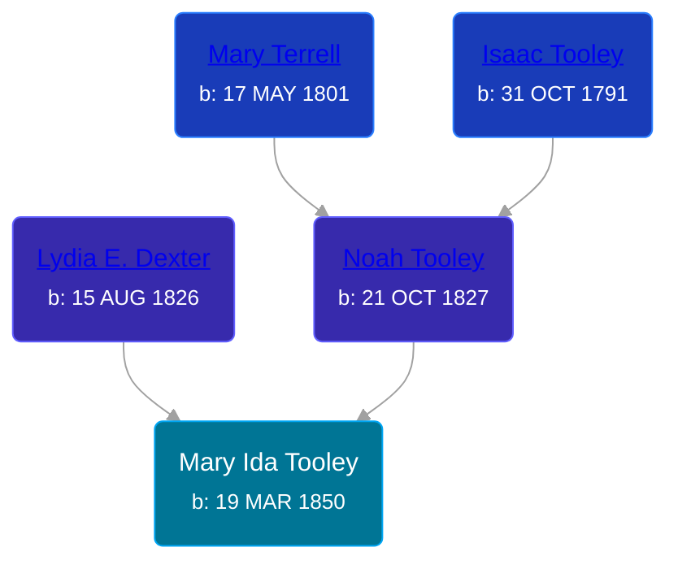

## 🟣 Mary Ida Tooley
<small>Age: 72y, 10m, 4d</small>

Daughter of [Noah Tooley](/people/8/84640933) and [Lydia E. Dexter](/people/6/67357568)





### 📆 Events


Type | Date | Age at Event | Place
------ | ------ | ------ | ------
Birth | 19 MAR 1850 |  | Orleans, New York, USA
[Residence](#event-event-0) | 07 SEP 1850 | 5m, 18d | Royalton, Niagra, New York, USA
[Residence](#event-event-1) | 23 JUN 1860 | 10y, 3m, 4d | Paris Township, Kent, Michigan, USA
[Residence](#event-event-2) | 1870 | 19y, 8m, 11d | Paris Township, Kent, Michigan, USA
[Residence](#event-event-3) | 1880 | 29y, 8m, 11d | Paris Township, Kent, Michigan, USA
[Residence](#event-event-4) | 23 JAN 1884 | 33y, 10m, 4d | Paris Township, Kent, Michigan, USA
[Residence](#event-event-5) | 1894 | 43y, 8m, 11d | Paris Township, Kent, Michigan, USA
[Residence](#event-event-6) | 1900 | 49y, 8m, 11d | Paris Township, Kent, Michigan, USA
[Residence](#event-event-7) | 1910 | 59y, 8m, 11d | Paris Township, Kent, Michigan, USA
[Residence](#event-event-8) | 10 JAN 1920 | 69y, 9m, 21d | Grand Rapids, Kent, Michigan, United States
[Death](#event-event-13) | 23 JAN 1923 | 72y, 10m, 4d | Grand Rapids, Kent, Michigan, United States
Burial | 26 JAN 1923 | 72y, 10m, 7d | Oak Grove Cemetery



- **Birth**
**Date**: 19 MAR 1850, Age:
**Place**: Orleans, New York, USA
- **[Residence](#event-event-0)**
**Date**: 07 SEP 1850, Age: 5m, 18d
**Place**: Royalton, Niagra, New York, USA
- **[Residence](#event-event-1)**
**Date**: 23 JUN 1860, Age: 10y, 3m, 4d
**Place**: Paris Township, Kent, Michigan, USA
- **[Residence](#event-event-2)**
**Date**: 1870, Age: 19y, 8m, 11d
**Place**: Paris Township, Kent, Michigan, USA
- **[Residence](#event-event-3)**
**Date**: 1880, Age: 29y, 8m, 11d
**Place**: Paris Township, Kent, Michigan, USA
- **[Residence](#event-event-4)**
**Date**: 23 JAN 1884, Age: 33y, 10m, 4d
**Place**: Paris Township, Kent, Michigan, USA
- **[Residence](#event-event-5)**
**Date**: 1894, Age: 43y, 8m, 11d
**Place**: Paris Township, Kent, Michigan, USA
- **[Residence](#event-event-6)**
**Date**: 1900, Age: 49y, 8m, 11d
**Place**: Paris Township, Kent, Michigan, USA
- **[Residence](#event-event-7)**
**Date**: 1910, Age: 59y, 8m, 11d
**Place**: Paris Township, Kent, Michigan, USA
- **[Residence](#event-event-8)**
**Date**: 10 JAN 1920, Age: 69y, 9m, 21d
**Place**: Grand Rapids, Kent, Michigan, United States
- **[Death](#event-event-13)**
**Date**: 23 JAN 1923, Age: 72y, 10m, 4d
**Place**: Grand Rapids, Kent, Michigan, United States
- **Burial**
**Date**: 26 JAN 1923, Age: 72y, 10m, 7d
**Place**: Oak Grove Cemetery


## 👩‍❤️‍👨 Relationships

### 🔵 [Curtland Terrell](/people/4/47972604), b. Aug 1856

#### Events


Type | Date | Age at Event | Place
------ | ------ | ------ | ------
[Marriage](#event-family-0-event-0) | 22 JAN 1880 | 29y, 10m, 3d | Paris Township, Kent, Michigan, USA



- **[Marriage](#event-family-0-event-0)**
**Date**: 22 JAN 1880, Age: 29y, 10m, 3d
**Place**: Paris Township, Kent, Michigan, USA


#### Children With Curtland Terrell
* 🔵 [Fred Terrell](/people/9/92332748), b. 20 OCT 1881
* 🟣 [Clara E. Terrell](/people/6/62490094), b. 07 NOV 1883
* 🟣 [Ida Mary Terrell](/people/7/71382896), b. 17 NOV 1891
* 🔵 [Arthur Terrell](/people/7/79436691), b. 06 FEB 1894
### 📰 Event Sources

####  Residence, 07 SEP 1850
* 1850 US Census

####  Residence, 23 JUN 1860
* 1860 US Census

####  Residence, 1870
* 1870 US Census

####  Residence, 1880
* 1880 US Census

####  Marriage, 22 JAN 1880
* Kent County Marriage Records
>   
  > Date of Record: 24 Jan 1880  
  > Date of Marriage: 22 Jan 1880  
  > Place of Marriage: Paris Township, Kent County, Michigan  
  > Groom: Curtland Terrell  
  > Bride: Mary I. (Tooley) Miner  
  > Groom's Birthplace: Byron Township, Kent County, Michigan  
  > Groom's Parents:  
  > Groom's Prev. Marriages:  
  > Bride's Birthplace: Orleans County, New York  
  > Bride's Parents:  
  > Bride's Prev. Marriages:

####  Residence, 23 JAN 1884
* 1884 Michigan State Census

####  Residence, 1894
* 1894 Michigan State Census

####  Residence, 1900
* 1900 US Census

####  Residence, 1910
* 1910 US Census

####  Residence, 10 JAN 1920
* 1920 US Census

####  Death, 23 JAN 1923
* Kent County Death Records  - Book 11, Page 335, Record 141
>   
  > Name: Mary Ida Terrell  
  > Date of Death: 24 Jan 1923  
  > Date of Record: 31 Jan 1923  
  > Place of Death: Grand Rapids, Kent County, Michigan  
  > Cause of Death: La Grippe  
  > Father: Noah Tooley  
  > Mother: Lydia Dexter
* The Grand Rapids Herald
>   
  > MARY IDA Terrell  
  > Mary Ida Terrell died at the home of her daughter, Mrs. Ray Matthews, 122 Shelby St., SW., Jan 24, aged 72. Funeral Friday at 3 p.m. at N. J. Corkery chapel, 558 S. Division, Rev. H. E. Walker officiating. Interment in Oak Grove cemetery.
* Michigan, Death Records, 1867-1950
>   
  > Name: Mary Ida Jerrell [Mary Ida Foohey]   
  > Gender: Female  
  > Race: White  
  > Marital Status: Married  
  > Death Age: 72  
  > Birth Date: 19 Mar 1850  
  > Birth Place: New York State  
  > Death Date: 24 Jan 1923  
  > Death Place: Grand Rapids, Kent, Michigan, USA  
  > File Number: 003257  
  > Father: Noah Foohey  
  > Mother: Lydia Dexter
