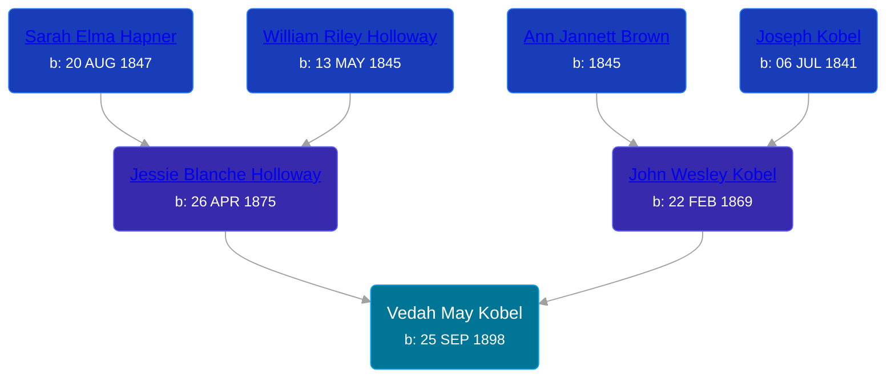

## 🟣 Vedah May Kobel
<small>Age: 13y, 6d</small>

Daughter of [John Wesley Kobel](/people/2/24649136) and [Jessie Blanche Holloway](/people/2/29242864)





### 📆 Events


Type | Date | Age at Event | Place
------ | ------ | ------ | ------
Birth | 25 SEP 1898 |  | Antrim, Michigan, USA
[Residence](#event-event-0) | 15 APR 1910 | 11y, 6m, 20d | Warner Township, Antrim, Michigan, USA
[Death](#event-event-4) | 01 OCT 1911 | 13y, 6d | Warner Township, Antrim, Michigan, USA



- **Birth**
**Date**: 25 SEP 1898, Age:
**Place**: Antrim, Michigan, USA
- **[Residence](#event-event-0)**
**Date**: 15 APR 1910, Age: 11y, 6m, 20d
**Place**: Warner Township, Antrim, Michigan, USA
- **[Death](#event-event-4)**
**Date**: 01 OCT 1911, Age: 13y, 6d
**Place**: Warner Township, Antrim, Michigan, USA


### 📰 Event Sources

####  Residence, 15 APR 1910
* 1910 US Census

####  Death, 01 OCT 1911
* Michigan Death Certificates
>   
  > State of Michigan  
  >   
  > Department of State -- Division of Vital Statistics  
  >   
  > Transcript of Certificate of Death  
  >   
  > Registered No. 7  
  >   
  >   
  > Place of Death  
  >   
  > County: Antrim  
  >   
  > Township/Village/City: Warner  
  >   
  > Full Name: Veda May Kobel  
  >   
  >   
  > Personal and Statistical Particulars  
  >   
  > Sex: Female  
  > Color/Race: White  
  > Date of Birth: Sep 25, 1898  
  > Aged: 13 years 0 months 5 days  
  > Single/Married/Widowed/Divorsed: Single  
  > Birthplace: Antrim County, Michigan  
  > Name of Father: John Kobel  
  > Birtplace of Father: Michigan  
  > Maiden Name of Mother: Jessie Holloway  
  > Birthplace of Mother: Michigan  
  > Occupation: Student  
  >   
  >   
  > Medical Certificate of Death  
  >   
  > Date of Death: Oct 1, 1911  
  >   
  > Cause of Death: I hereby certify, that I attended deceased from Sep. 16, 1911, to Oct. 1, 1911, that I last saw her alive on Sep. 30, 1911, and that death occurred on the date stated above at 11:00 am. The cause of death was as follows: typhoid fever  
  >   
  > Duration: 14 days  
  >   
  > Place of Burial or Removal: Elmira  
  > Date of Burial: OCt. 3, 1911  
  >   
  > Filed: Oct. 2, 1911
