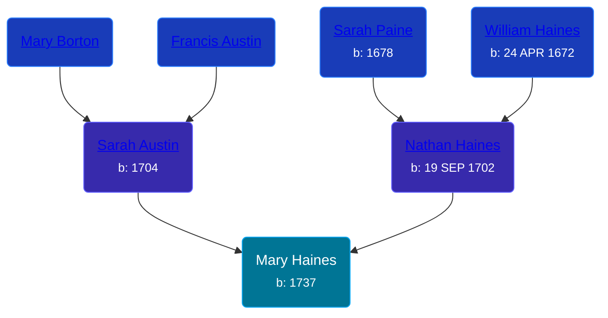

## 🟣 Mary Haines
<small>Age: 55y</small>

Daughter of [Nathan Haines](/people/7/74064515) and [Sarah Austin](/people/4/4530755)





### 📆 Events


Type | Date | Age at Event | Place
------ | ------ | ------ | ------
Birth | 1737 |  | Burlington, New Jersey, USA
Death | 1792 | 55y | Crooked Run, Culpeper, Virginia, USA



- **Birth**
**Date**: 1737, Age:
**Place**: Burlington, New Jersey, USA
- **Death**
**Date**: 1792, Age: 55y
**Place**: Crooked Run, Culpeper, Virginia, USA


## 👩‍❤️‍👨 Relationships

### 🔵 [Isaac Holloway](/people/9/97947565), b. 25 OCT 1735

#### Events


Type | Date | Age at Event | Place
------ | ------ | ------ | ------
[Marriage](#event-family-0-event-0) | 16 NOV 1758 | 21y, 11m, 16d |



- **[Marriage](#event-family-0-event-0)**
**Date**: 16 NOV 1758, Age: 21y, 11m, 16d
**Place**:


#### Children With Isaac Holloway
* 🔵 [Isaac Holloway](/people/9/9759504), b. 1767
### 📰 Event Sources

####  Marriage, 16 NOV 1758
* Ancestry of the Haines, Sharp, Collins, Wills, Gardiner, Prickitt, Eves, Evans, Moore, Troth, Borton and Engle Families.  - 36
